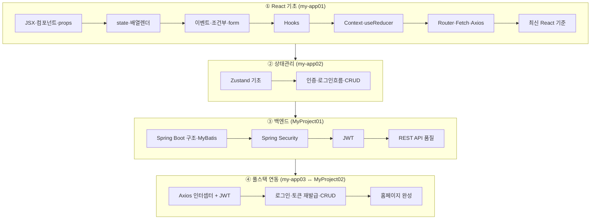
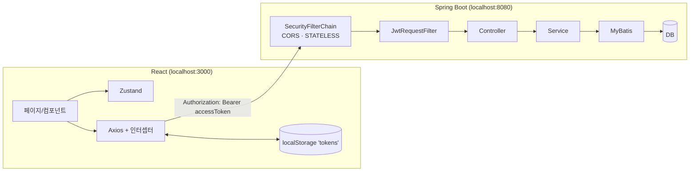

# 📚 React + Spring Boot 풀스택 학습 아카이브

React 기초부터 **Spring Boot + JWT 백엔드 연동**까지, 강의 필기와 실습 코드를 하나로 정리한 학습 자료입니다.
정제된 **학습 노트([`docs/`](docs/))** 와 **실습 코드([`code/`](code/))** 를 함께 보며 이론·흐름을 따라갈 수 있도록 구성했습니다.

## 🚀 처음 오셨다면: 여기서 시작하세요

가장 먼저 **[온라인 학습 자료 사이트](https://notetester.github.io/REACT/)** 를 여세요.
GitHub 저장소는 파일을 보관하는 곳이고, 온라인 학습 자료 사이트는 노트를 순서대로 읽고 검색하며 데모를 실행하는 **교재 화면**입니다.
처음에는 저장소를 클론하거나 DB를 설치하지 않아도 됩니다.

| 하고 싶은 일 | 시작 위치 | 설치 필요 여부 |
|--------------|-----------|----------------|
| 전체 학습 순서 파악 | [온라인 학습 자료 홈](https://notetester.github.io/REACT/) | 없음 |
| React 화면부터 체험 | [React 단계별 결과 탐색기](https://notetester.github.io/REACT/demo/react-basics/#/lab) | 없음 |
| 최종 UI와 CRUD 흐름 체험 | [React + Spring 연동 mock 데모](https://notetester.github.io/REACT/demo/integration/)에서 `study` / `1111` 로그인 | 없음 |
| 실제 Spring Boot API 실행 결과 확인 | [Actions API 스냅샷](https://notetester.github.io/REACT/generated/integration-snapshot/) | 없음 |
| 코드를 직접 수정하며 실습 | [`code/`](code/)를 내려받고 단계별 로컬 실행 | Node.js, 단계에 따라 Java·DB 필요 |

> **GitHub Pages의 역할**
>
> [온라인 학습 자료 사이트](https://notetester.github.io/REACT/)는 문서와 React 데모를 정적 파일로 배포합니다.
> Pages 자체에서 Spring Boot나 Oracle XE를 실행하지는 않습니다.
> 최종 UI는 브라우저 `localStorage` 기반 mock으로 체험하고, 실제 백엔드 시나리오는 GitHub Actions가 임시 H2 DB로 실행한 [API 스냅샷](https://notetester.github.io/REACT/generated/integration-snapshot/)에서 확인합니다.
> 마지막 단계에서는 로컬 PC에 Oracle XE를 설치해 프론트엔드와 백엔드를 직접 연결합니다.

### 학습하는 방법

각 단계에서 아래 순서를 반복하세요.

1. [온라인 학습 자료 사이트](https://notetester.github.io/REACT/)의 왼쪽 내비게이션에서 해당 노트를 읽습니다.
2. 노트의 핵심 개념을 확인한 뒤 연결된 실습 코드를 실행합니다.
3. 코드를 그대로 실행하는 데서 멈추지 말고, 문자열·컴포넌트·API 경로·폼 항목을 작게 바꾸어 결과를 확인합니다.
4. 예상과 다른 결과가 나오면 브라우저 개발자 도구의 Console·Network 탭과 Spring Boot 로그를 함께 확인합니다.
5. 단계별 완료 기준을 만족하면 다음 단계로 이동합니다.

### 초심자 권장 진행 순서

처음부터 모든 도구와 DB를 한꺼번에 설치하지 마세요. React 화면을 먼저 익히고, DB가 필요한 시점에 백엔드 환경을 추가하면 흐름을 이해하기 쉽습니다.

| 단계 | 먼저 읽을 노트 | 함께 볼 코드·데모 | 이 단계에서 준비할 것 | 완료 기준 |
|------|----------------|-------------------|------------------------|-----------|
| 0. 전체 모습 둘러보기 | [온라인 자료 홈](https://notetester.github.io/REACT/), [온라인 mock과 Actions 스냅샷](docs/integration/online-demo-and-snapshot.md) | [integration mock 데모](https://notetester.github.io/REACT/demo/integration/) | 설치 없음 | Pages mock, Actions H2, 로컬 DB의 역할 차이를 말할 수 있다. |
| 1. React 기초 | [React 01~09](docs/react/01-intro-setup.md) | [my-app01](code/react/01-basics-my-app01), [단계별 결과 탐색기](https://notetester.github.io/REACT/demo/react-basics/#/lab) | Node.js 20 | 컴포넌트, `props`, `state`, 이벤트, 폼, Hook, Router, Axios의 역할을 설명하고 화면을 수정할 수 있다. |
| 2. 최신 React와 상태관리 | [React 10~12](docs/react/10-zustand-basics.md) | [my-app02](code/react/02-zustand-my-app02), [온라인 Zustand 데모](https://notetester.github.io/REACT/demo/zustand/) | Node.js 20 | Zustand store와 컴포넌트 상태를 구분하고, CRA 실습과 신규 Vite 프로젝트의 차이를 이해한다. |
| 3. Spring Boot 백엔드 | [Spring Boot 01~04](docs/springboot/01-intro-architecture.md) | [MyProject01](code/springboot/01-jwt-MyProject01) | Java 21, MySQL | Controller → Service → Mapper → DB 흐름과 Security·JWT·DTO·Validation을 설명할 수 있다. |
| 4. React ↔ Spring Boot 연동 | [JWT 연동 흐름](docs/integration/react-springboot-jwt-flow.md), [로컬 실행 가이드](docs/guide/01-local-setup.md) | [my-app03](code/react/03-integration-my-app03) ↔ [MyProject02](code/springboot/02-integration-MyProject02) | Java 21, Oracle XE | 회원가입, 로그인, 토큰 인증, 프로필, 방명록 CRUD를 로컬에서 끝까지 실행할 수 있다. |
| 5. 직접 재구성 | [최종 홈페이지 완성 로드맵](docs/integration/final-homepage-roadmap.md) | 앞 단계의 코드를 참고하되 직접 구현 | 앞 단계 환경 | 화면 → API → DB → JWT → 오류 처리 순서로 작은 홈페이지를 다시 만들 수 있다. |

### 설치 시점을 한눈에 보기

- **노트 읽기와 온라인 데모 체험만 할 때:** 설치가 필요 없습니다.
- **React 코드를 수정할 때:** Node.js 20을 설치합니다.
- **Spring Boot 기초 실습을 시작할 때:** Java 21과 MySQL을 준비합니다.
- **최종 연동 실습을 시작할 때:** Oracle XE를 추가하고 [Windows 로컬 DB 설치와 초기화](docs/guide/02-local-db-setup.md)를 따라갑니다.
- **문제가 생겼을 때:** [로컬 실습 실행 가이드](docs/guide/01-local-setup.md)의 실행 순서와 점검 항목을 먼저 확인합니다.

> 필기(Notion)와 실습 코드를 분석·취합·보강하여 작성했습니다. 강사 노트의 다이어그램/스크린샷은 [`docs/assets/img/`](docs/assets/img/)에 원본 그대로 보존했습니다.
> 추출한 원문 Markdown도 [`docs/archive/notion-raw/`](docs/archive/notion-raw/)에 보존했습니다. 취합 범위는 [`docs/reference/source-coverage.md`](docs/reference/source-coverage.md)에서 확인할 수 있습니다.

---

## 🗺️ 학습 로드맵



## 🏛️ 전체 아키텍처 (최종 응용)



자세한 흐름 → **[★ React ↔ Spring Boot JWT 연동 흐름](docs/integration/react-springboot-jwt-flow.md)**

직접 완성하기 → **[간단한 홈페이지 완성 로드맵](docs/integration/final-homepage-roadmap.md)**

설치 없이 최종 UI를 확인하려면 **[온라인 integration mock 데모](https://notetester.github.io/REACT/demo/integration/)** 를 열어 `study` / `1111`로 로그인하세요. mock, Actions H2, 로컬 Oracle XE의 차이는 **[온라인 mock 데모와 Actions API 스냅샷](docs/integration/online-demo-and-snapshot.md)** 에 정리했습니다.

---

## 📖 목차 — 노트 ↔ 코드

React 노트 01~11에는 코드를 읽는 자리에서 바로 조작할 수 있는 **라이브 결과 화면**을 삽입했습니다. 전체 예제를 한곳에서 비교하려면 **[React 단계별 결과 탐색기](https://notetester.github.io/REACT/demo/react-basics/#/lab)** 를 여세요.

### React
| # | 학습 노트 | 실습 코드 |
|---|-----------|-----------|
| 01 | [소개·설치·구조](docs/react/01-intro-setup.md) | [my-app01](code/react/01-basics-my-app01) |
| 02 | [JSX·컴포넌트·props](docs/react/02-jsx-components.md) | `step01~02` |
| 03 | [state·배열 고차메서드](docs/react/03-state-list-events.md) | `step03~04` |
| 04 | [조건부·이벤트·CSS·props·form](docs/react/04-events-forms.md) | `step05~10` |
| 05 | [Hooks](docs/react/05-hooks.md) | `step11-hook` |
| 06 | [Context API](docs/react/06-context.md) | `step12~13` |
| 07 | [useReducer](docs/react/07-usereducer.md) | `step14-Reducer` |
| 08 | [React Router](docs/react/08-router.md) | `step15~16` |
| 09 | [Fetch·Axios](docs/react/09-fetch-axios.md) | `step17~18` |
| 10 | [Zustand 기초](docs/react/10-zustand-basics.md) | [my-app02](code/react/02-zustand-my-app02) |
| 11 | [Zustand 인증·CRUD](docs/react/11-zustand-auth-crud.md) | [my-app02](code/react/02-zustand-my-app02) |
| 12 | [최신 React 학습 로드맵](docs/react/12-modern-react-roadmap.md) | 기존 CRA 복습 ↔ 신규 Vite·프레임워크 선택 기준 |

### Spring Boot
| # | 학습 노트 | 실습 코드 |
|---|-----------|-----------|
| 01 | [구조·레이어드·MyBatis](docs/springboot/01-intro-architecture.md) | [MyProject01](code/springboot/01-jwt-MyProject01) |
| 02 | [Spring Security](docs/springboot/02-spring-security.md) | [MyProject01](code/springboot/01-jwt-MyProject01) |
| 03 | [JWT](docs/springboot/03-jwt.md) | [MyProject01](code/springboot/01-jwt-MyProject01) |
| 04 | [REST API 품질](docs/springboot/04-rest-api-quality.md) | DTO·Validation·ProblemDetail·테스트 확장 |

### 🔗 연동 (최종 응용)
| 학습 노트 | 실습 코드 |
|-----------|-----------|
| [★ React ↔ Spring Boot JWT 연동 흐름](docs/integration/react-springboot-jwt-flow.md) | [my-app03](code/react/03-integration-my-app03) ↔ [MyProject02](code/springboot/02-integration-MyProject02) |
| [간단한 홈페이지 완성 로드맵](docs/integration/final-homepage-roadmap.md) | 화면 → API → DB → JWT → 검증 순서 체크리스트 |

---

## 🧰 기술 스택

| 영역 | 스택 |
|------|------|
| Frontend | React 19, React Router v6, Zustand 5, Axios, MUI (CRA / react-scripts) |
| Backend | Spring Boot, Spring Security, JWT(jjwt 0.11.5), MyBatis, Java 21, Gradle |
| DB | MySQL(MyProject01) / Oracle(MyProject02) |

## 📁 폴더 구조
```
REACT/
├── docs/                       # 학습 노트 (이 문서들)
│   ├── react/        01~12
│   ├── springboot/   01~04
│   ├── integration/  연동 흐름·온라인 mock·Actions 스냅샷 안내
│   ├── generated/    Pages 배포 때 생성되는 API 실행 결과
│   ├── guide/        로컬 실행·시크릿
│   ├── reference/    취합 범위·이미지·정오표
│   ├── archive/      추출 당시 원문 Markdown
│   └── assets/img/   강사 노트 원본 캡처(다이어그램·스크린샷)
├── code/                       # 실습 코드 (소스만, node_modules 제외)
│   ├── react/        01-basics / 02-zustand / 03-integration
│   └── springboot/   01-jwt / 02-integration
└── .github/workflows/          # CI · GitHub Pages · 데모 배포
```

## ▶️ 로컬 실행
```bash
# React (각 my-app 폴더에서)
npm install && npm start          # http://localhost:3000

# Spring Boot (각 MyProject 폴더에서)
./gradlew bootRun                 # http://localhost:8080
```
> 새 PC에서는 먼저 **[Windows 로컬 DB 설치와 초기화](docs/guide/02-local-db-setup.md)** 를 진행하세요. 연동 실행 순서, 접속 정보와 환경변수는 **[로컬 실습 실행 가이드](docs/guide/01-local-setup.md)** 에 정리했습니다.

## ⚠️ 보안 주의
실습 코드에는 클론 직후 실행을 위한 **localhost 전용 기본값**이 있습니다. 외부 환경에서는 `DB_PASSWORD`, `JWT_SECRET` 환경변수나 GitHub Actions Repository secrets로 덮어써야 합니다. 자세한 구분은 **[실습용 시크릿과 GitHub Actions](docs/guide/02-security-and-actions-secrets.md)** 를 참고하세요.

## ✅ CI 범위
GitHub Actions는 React 3개와 Spring Boot 2개의 빌드를 확인합니다. 추가로 임시 MySQL 8.4 컨테이너에서 `MyProject01`의 DB 조회 API를 호출합니다. Pages workflow는 `MyProject02`를 임시 H2 Oracle mode로 실행해 회원가입·로그인·JWT 인증·방명록 CRUD 결과를 [API 스냅샷](docs/generated/integration-snapshot.md)으로 생성합니다. 로컬 최종 연동의 기본 DB는 Oracle XE입니다.

## 🙏 출처
강의 필기(Notion)와 실습 코드를 학습 목적으로 분석·정리·보강한 자료입니다. 다이어그램·스크린샷의 원저작권은 원 강의에 있습니다.

최신 공식 문서 대조 결과와 의도적인 학습용 단순화는 **[최신 공식 문서 감수 기록](docs/reference/official-reference-audit.md)** 에 정리했습니다.
