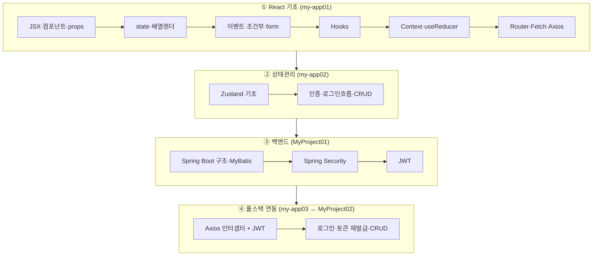
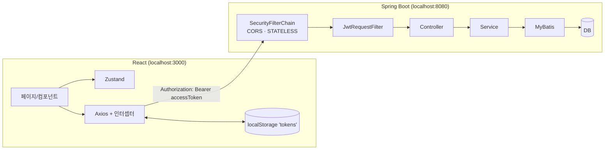

# 📚 React + Spring Boot 풀스택 학습 아카이브

React 기초부터 **Spring Boot + JWT 백엔드 연동**까지, 강의 필기와 실습 코드를 하나로 정리한 학습 자료입니다.
정제된 **학습 노트([`docs/`](docs/))** 와 **실습 코드([`code/`](code/))** 를 함께 보며 이론·흐름을 따라갈 수 있도록 구성했습니다.

> 필기(Notion)와 실습 코드를 분석·취합·보강하여 작성했습니다. 강사 노트의 다이어그램/스크린샷은 [`docs/assets/img/`](docs/assets/img/)에 원본 그대로 보존했습니다.

---

## 🗺️ 학습 로드맵



## 🏛️ 전체 아키텍처 (최종 응용)



자세한 흐름 → **[★ React ↔ Spring Boot JWT 연동 흐름](docs/integration/react-springboot-jwt-flow.md)**

---

## 📖 목차 — 노트 ↔ 코드

### React
| # | 학습 노트 | 실습 코드 |
|---|-----------|-----------|
| 01 | [소개·설치·구조](docs/react/01-intro-setup.md) | [my-app01](code/react/01-basics-my-app01) |
| 02 | [JSX·컴포넌트·props](docs/react/02-jsx-components.md) | `step01~02` |
| 03 | [state·배열 고차메서드](docs/react/03-state-list-events.md) | `step03~04` |
| 04 | [조건부·이벤트·CSS·props·form](docs/react/04-events-forms.md) | `step05~10` |
| 05 | [Hooks](docs/react/05-hooks.md) | `step11-hook` |
| 06 | [Context API](docs/react/06-context.md) | `step12~13` |
| 07 | [useReducer](docs/react/07-usereducer.md) | `step14-Reducer` |
| 08 | [React Router](docs/react/08-router.md) | `step15~16` |
| 09 | [Fetch·Axios](docs/react/09-fetch-axios.md) | `step17~18` |
| 10 | [Zustand 기초](docs/react/10-zustand-basics.md) | [my-app02](code/react/02-zustand-my-app02) |
| 11 | [Zustand 인증·CRUD](docs/react/11-zustand-auth-crud.md) | [my-app02](code/react/02-zustand-my-app02) |

### Spring Boot
| # | 학습 노트 | 실습 코드 |
|---|-----------|-----------|
| 01 | [구조·레이어드·MyBatis](docs/springboot/01-intro-architecture.md) | [MyProject01](code/springboot/01-jwt-MyProject01) |
| 02 | [Spring Security](docs/springboot/02-spring-security.md) | [MyProject01](code/springboot/01-jwt-MyProject01) |
| 03 | [JWT](docs/springboot/03-jwt.md) | [MyProject01](code/springboot/01-jwt-MyProject01) |

### 🔗 연동 (최종 응용)
| 학습 노트 | 실습 코드 |
|-----------|-----------|
| [★ React ↔ Spring Boot JWT 연동 흐름](docs/integration/react-springboot-jwt-flow.md) | [my-app03](code/react/03-integration-my-app03) ↔ [MyProject02](code/springboot/02-integration-MyProject02) |

---

## 🧰 기술 스택

| 영역 | 스택 |
|------|------|
| Frontend | React 19, React Router v7, Zustand 5, Axios, MUI (CRA / react-scripts) |
| Backend | Spring Boot, Spring Security, JWT(jjwt 0.11.5), MyBatis, Java 21, Gradle |
| DB | MySQL(MyProject01) / Oracle(MyProject02) |

## 📁 폴더 구조
```
REACT/
├── docs/                       # 학습 노트 (이 문서들)
│   ├── react/        01~11
│   ├── springboot/   01~03
│   ├── integration/  연동 흐름
│   └── assets/img/   강사 노트 원본 캡처(다이어그램·스크린샷)
├── code/                       # 실습 코드 (소스만, node_modules 제외)
│   ├── react/        01-basics / 02-zustand / 03-integration
│   └── springboot/   01-jwt / 02-integration
└── .github/workflows/          # CI · GitHub Pages · 데모 배포
```

## ▶️ 로컬 실행
```bash
# React (각 my-app 폴더에서)
npm install && npm start          # http://localhost:3000

# Spring Boot (각 MyProject 폴더에서)
./gradlew bootRun                 # http://localhost:8080
```
> 연동 실행은 백엔드(8080) 먼저 기동 후 프론트(3000)를 실행하세요. DB 스키마(members/guestbook/refresh_token)와 접속 정보는 각 `application.yaml` 참고.

## ⚠️ 보안 주의
실습 코드의 `application.yaml`에는 학습용 **localhost DB 비밀번호·JWT 시크릿**이 포함되어 있습니다. 실무에서는 이런 값을 **환경변수/시크릿 매니저로 분리**하고 저장소에 커밋하지 마세요.

## 🙏 출처
강의 필기(Notion)와 실습 코드를 학습 목적으로 분석·정리·보강한 자료입니다. 다이어그램·스크린샷의 원저작권은 원 강의에 있습니다.
