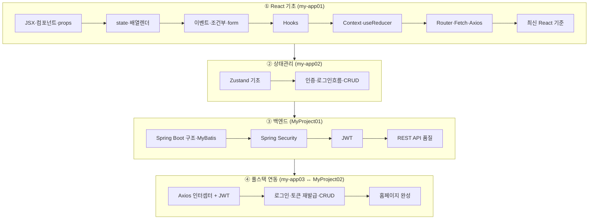
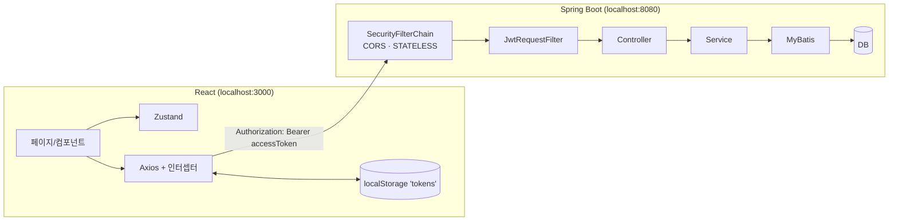

# 📚 React + Spring Boot 풀스택 학습 아카이브

React 기초부터 **Spring Boot + JWT 백엔드 연동**까지, 강의 필기와 실습 코드를 하나로 정리한 학습 자료입니다.
정제된 **학습 노트([`docs/`](docs/))** 와 **실습 코드([`code/`](code/))** 를 함께 보며 이론·흐름을 따라갈 수 있도록 구성했습니다.

> 필기(Notion)와 실습 코드를 분석·취합·보강하여 작성했습니다. 강사 노트의 다이어그램/스크린샷은 [`docs/assets/img/`](docs/assets/img/)에 원본 그대로 보존했습니다.
> 추출한 원문 Markdown도 [`docs/archive/notion-raw/`](docs/archive/notion-raw/)에 보존했습니다. 취합 범위는 [`docs/reference/source-coverage.md`](docs/reference/source-coverage.md)에서 확인할 수 있습니다.

---

## 🗺️ 학습 로드맵



## 🏛️ 전체 아키텍처 (최종 응용)



자세한 흐름 → **[★ React ↔ Spring Boot JWT 연동 흐름](docs/integration/react-springboot-jwt-flow.md)**

직접 완성하기 → **[간단한 홈페이지 완성 로드맵](docs/integration/final-homepage-roadmap.md)**

설치 없이 최종 UI를 확인하려면 **[온라인 integration mock 데모](https://notetester.github.io/REACT/demo/integration/)** 를 열어 `study` / `1111`로 로그인하세요. mock, Actions H2, 로컬 Oracle XE의 차이는 **[온라인 mock 데모와 Actions API 스냅샷](docs/integration/online-demo-and-snapshot.md)** 에 정리했습니다.

---

## 📖 목차 — 노트 ↔ 코드

### React
| # | 학습 노트 | 실습 코드 |
|---|-----------|-----------|
| 01 | [소개·설치·구조](docs/react/01-intro-setup.md) | [my-app01](code/react/01-basics-my-app01) |
| 02 | [JSX·컴포넌트·props](docs/react/02-jsx-components.md) | `step01~02` |
| 03 | [state·배열 고차메서드](docs/react/03-state-list-events.md) | `step03~04` |
| 04 | [조건부·이벤트·CSS·props·form](docs/react/04-events-forms.md) | `step05~10` |
| 05 | [Hooks](docs/react/05-hooks.md) | `step11-hook` |
| 06 | [Context API](docs/react/06-context.md) | `step12~13` |
| 07 | [useReducer](docs/react/07-usereducer.md) | `step14-Reducer` |
| 08 | [React Router](docs/react/08-router.md) | `step15~16` |
| 09 | [Fetch·Axios](docs/react/09-fetch-axios.md) | `step17~18` |
| 10 | [Zustand 기초](docs/react/10-zustand-basics.md) | [my-app02](code/react/02-zustand-my-app02) |
| 11 | [Zustand 인증·CRUD](docs/react/11-zustand-auth-crud.md) | [my-app02](code/react/02-zustand-my-app02) |
| 12 | [최신 React 학습 로드맵](docs/react/12-modern-react-roadmap.md) | 기존 CRA 복습 ↔ 신규 Vite·프레임워크 선택 기준 |

### Spring Boot
| # | 학습 노트 | 실습 코드 |
|---|-----------|-----------|
| 01 | [구조·레이어드·MyBatis](docs/springboot/01-intro-architecture.md) | [MyProject01](code/springboot/01-jwt-MyProject01) |
| 02 | [Spring Security](docs/springboot/02-spring-security.md) | [MyProject01](code/springboot/01-jwt-MyProject01) |
| 03 | [JWT](docs/springboot/03-jwt.md) | [MyProject01](code/springboot/01-jwt-MyProject01) |
| 04 | [REST API 품질](docs/springboot/04-rest-api-quality.md) | DTO·Validation·ProblemDetail·테스트 확장 |

### 🔗 연동 (최종 응용)
| 학습 노트 | 실습 코드 |
|-----------|-----------|
| [★ React ↔ Spring Boot JWT 연동 흐름](docs/integration/react-springboot-jwt-flow.md) | [my-app03](code/react/03-integration-my-app03) ↔ [MyProject02](code/springboot/02-integration-MyProject02) |
| [간단한 홈페이지 완성 로드맵](docs/integration/final-homepage-roadmap.md) | 화면 → API → DB → JWT → 검증 순서 체크리스트 |

---

## 🧰 기술 스택

| 영역 | 스택 |
|------|------|
| Frontend | React 19, React Router v6, Zustand 5, Axios, MUI (CRA / react-scripts) |
| Backend | Spring Boot, Spring Security, JWT(jjwt 0.11.5), MyBatis, Java 21, Gradle |
| DB | MySQL(MyProject01) / Oracle(MyProject02) |

## 📁 폴더 구조
```
REACT/
├── docs/                       # 학습 노트 (이 문서들)
│   ├── react/        01~12
│   ├── springboot/   01~04
│   ├── integration/  연동 흐름·온라인 mock·Actions 스냅샷 안내
│   ├── generated/    Pages 배포 때 생성되는 API 실행 결과
│   ├── guide/        로컬 실행·시크릿
│   ├── reference/    취합 범위·이미지·정오표
│   ├── archive/      추출 당시 원문 Markdown
│   └── assets/img/   강사 노트 원본 캡처(다이어그램·스크린샷)
├── code/                       # 실습 코드 (소스만, node_modules 제외)
│   ├── react/        01-basics / 02-zustand / 03-integration
│   └── springboot/   01-jwt / 02-integration
└── .github/workflows/          # CI · GitHub Pages · 데모 배포
```

## ▶️ 로컬 실행
```bash
# React (각 my-app 폴더에서)
npm install && npm start          # http://localhost:3000

# Spring Boot (각 MyProject 폴더에서)
./gradlew bootRun                 # http://localhost:8080
```
> 새 PC에서는 먼저 **[Windows 로컬 DB 설치와 초기화](docs/guide/02-local-db-setup.md)** 를 진행하세요. 연동 실행 순서, 접속 정보와 환경변수는 **[로컬 실습 실행 가이드](docs/guide/01-local-setup.md)** 에 정리했습니다.

## ⚠️ 보안 주의
실습 코드에는 클론 직후 실행을 위한 **localhost 전용 기본값**이 있습니다. 외부 환경에서는 `DB_PASSWORD`, `JWT_SECRET` 환경변수나 GitHub Actions Repository secrets로 덮어써야 합니다. 자세한 구분은 **[실습용 시크릿과 GitHub Actions](docs/guide/02-security-and-actions-secrets.md)** 를 참고하세요.

## ✅ CI 범위
GitHub Actions는 React 3개와 Spring Boot 2개의 빌드를 확인합니다. 추가로 임시 MySQL 8.4 컨테이너에서 `MyProject01`의 DB 조회 API를 호출합니다. Pages workflow는 `MyProject02`를 임시 H2 Oracle mode로 실행해 회원가입·로그인·JWT 인증·방명록 CRUD 결과를 [API 스냅샷](docs/generated/integration-snapshot.md)으로 생성합니다. 로컬 최종 연동의 기본 DB는 Oracle XE입니다.

## 🙏 출처
강의 필기(Notion)와 실습 코드를 학습 목적으로 분석·정리·보강한 자료입니다. 다이어그램·스크린샷의 원저작권은 원 강의에 있습니다.

최신 공식 문서 대조 결과와 의도적인 학습용 단순화는 **[최신 공식 문서 감수 기록](docs/reference/official-reference-audit.md)** 에 정리했습니다.
