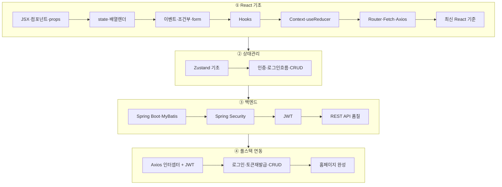
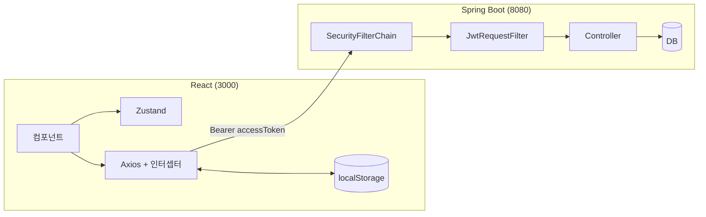

# 📚 React + Spring Boot 풀스택 학습 아카이브

React 기초부터 **Spring Boot + JWT 백엔드 연동**까지, 강의 필기와 실습 코드를 하나로 정리한 학습 자료입니다.

!!! tip "처음 방문했다면"
    이 사이트가 순서대로 읽는 **온라인 교재**입니다. 왼쪽 내비게이션에서 **React → Spring Boot → 연동(최종 응용)** 순서로 읽으세요. 처음에는 설치 없이 아래 라이브 데모를 둘러보고, 코드를 직접 수정할 때 저장소를 내려받으면 됩니다.

!!! info "자료 보존"
    [원본 자료 수집 범위](reference/source-coverage.md)에서 Notion 추출 원문, 이미지 63개, 로컬 실습 코드의 보존 위치를 확인할 수 있습니다.

## 🧭 처음 시작하는 방법

| 순서 | 할 일 | 설치 필요 여부 |
|------|-------|----------------|
| 1 | 이 페이지의 학습 로드맵과 최종 아키텍처를 먼저 읽습니다. | 없음 |
| 2 | [React 기초 데모](/REACT/demo/react-basics/)와 [연동 mock 데모](/REACT/demo/integration/)를 열어 완성된 화면을 살펴봅니다. 연동 데모는 `study` / `1111`로 로그인합니다. | 없음 |
| 3 | React 01부터 노트를 읽고 연결된 실습 코드를 직접 실행합니다. | Node.js 20 |
| 4 | Spring Boot 단계에 도착하면 Java 21과 MySQL을 준비합니다. | Java 21, MySQL |
| 5 | 최종 연동 단계에서 Oracle XE를 추가하고 React와 Spring Boot를 함께 실행합니다. | Oracle XE |

!!! warning "Pages, Actions, 로컬 실행은 서로 다릅니다"
    이 사이트의 React 데모는 설치 없이 화면을 체험하기 위한 정적 배포입니다. Pages는 Spring Boot나 DB를 실행하지 않습니다. [Actions API 실행 결과](generated/integration-snapshot.md)는 임시 H2 DB에서 실제 백엔드 흐름을 자동 검증한 기록입니다. 마지막 로컬 실습에서는 Oracle XE를 사용합니다. 자세한 차이는 [온라인 mock 데모와 Actions API 스냅샷](integration/online-demo-and-snapshot.md)에 정리했습니다.

각 장에서는 **노트 읽기 → 코드 실행 → 작은 수정 → 결과 확인**을 반복하세요. 문자열이나 폼 항목부터 바꾸고, API 단계에서는 브라우저 개발자 도구의 Console·Network 탭과 Spring Boot 로그를 함께 보는 습관을 들이면 좋습니다.

## 🗺️ 학습 로드맵

## 🏛️ 최종 응용 아키텍처

→ 자세히: **[React ↔ Spring Boot JWT 연동 흐름](integration/react-springboot-jwt-flow.md)**

→ 직접 완성하기: **[간단한 홈페이지 완성 로드맵](integration/final-homepage-roadmap.md)**

## 🚀 라이브 데모
- **[React 기초 데모 (my-app01)](/REACT/demo/react-basics/)** — Router·Fetch·Axios 단계별 화면
- **[Zustand 상태관리 데모 (my-app02)](/REACT/demo/zustand/)** — 로그인·Todo·메모·프로필 (백엔드 없이 동작)
- **[React + Spring 연동 mock 데모 (my-app03)](/REACT/demo/integration/)** — `study / 1111`, 방명록 CRUD와 프로필 흐름

## 🧭 추천 학습 순서

1. React 01~11에서 컴포넌트, 상태, Router, Axios, Zustand를 직접 실습합니다.
2. [React 12](react/12-modern-react-roadmap.md)에서 CRA 이후의 신규 프로젝트 시작 방법과 최신 상태·Effect 원칙을 정리합니다.
3. Spring Boot 01~03에서 DB, Security, JWT를 연결합니다.
4. [Spring Boot 04](springboot/04-rest-api-quality.md)에서 DTO, Validation, 오류 응답, 테스트 확장을 배웁니다.
5. [최종 홈페이지 로드맵](integration/final-homepage-roadmap.md)을 체크리스트로 삼아 전체 흐름을 직접 재구성합니다.

최신 공식 문서와 대조한 근거는 [감수 기록](reference/official-reference-audit.md)에 모았습니다.

## 🧰 기술 스택
React 19 · React Router v6 · Zustand 5 · Axios · MUI / Spring Boot · Spring Security · JWT(jjwt) · MyBatis · Java 21 · Gradle

## ▶️ 직접 실행

새 PC에서는 [Windows 로컬 DB 설치와 초기화](guide/02-local-db-setup.md)부터 시작합니다. 실행 순서는 [로컬 실습 실행 가이드](guide/01-local-setup.md), 실습용 비밀번호와 CI의 임시 DB 범위는 [시크릿과 GitHub Actions](guide/02-security-and-actions-secrets.md)에 정리했습니다.
