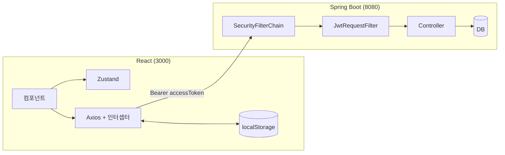

# 📚 React + Spring Boot 풀스택 학습 아카이브

React 기초부터 **Spring Boot + JWT 백엔드 연동**까지, 강의 필기와 실습 코드를 하나로 정리한 학습 자료입니다.

!!! tip "이렇게 보세요"
    왼쪽 내비게이션에서 **React → Spring Boot → 연동** 순서로 읽으면 흐름이 이어집니다. 각 노트에는 강사 노트의 다이어그램·스크린샷 원본과 실습 코드 링크가 함께 있습니다.

!!! info "자료 보존"
    [원본 자료 수집 범위](reference/source-coverage.md)에서 Notion 추출 원문, 이미지 63개, 로컬 실습 코드의 보존 위치를 확인할 수 있습니다.

## 🗺️ 학습 로드맵

```mermaid
flowchart TD
  subgraph R["① React 기초"]
    R1[JSX·컴포넌트·props] --> R2[state·배열렌더] --> R3[이벤트·조건부·form]
    R3 --> R4[Hooks] --> R5[Context·useReducer] --> R6[Router·Fetch·Axios]
  end
  subgraph Z["② 상태관리"]
    Z1[Zustand 기초] --> Z2[인증·로그인흐름·CRUD]
  end
  subgraph S["③ 백엔드"]
    S1[Spring Boot·MyBatis] --> S2[Spring Security] --> S3[JWT]
  end
  subgraph I["④ 풀스택 연동"]
    I1[Axios 인터셉터 + JWT] --> I2[로그인·토큰재발급·CRUD]
  end
  R --> Z --> S --> I
```

## 🏛️ 최종 응용 아키텍처

→ 자세히: **[React ↔ Spring Boot JWT 연동 흐름](integration/react-springboot-jwt-flow.md)**

## 🚀 라이브 데모
- **[React 기초 데모 (my-app01)](/REACT/demo/react-basics/)** — Router·Fetch·Axios 단계별 화면
- **[Zustand 상태관리 데모 (my-app02)](/REACT/demo/zustand/)** — 로그인·Todo·메모·프로필 (백엔드 없이 동작)

## 🧰 기술 스택
React 19 · React Router v6 · Zustand 5 · Axios · MUI / Spring Boot · Spring Security · JWT(jjwt) · MyBatis · Java 21 · Gradle

## ▶️ 직접 실행

새 PC에서는 [Windows 로컬 DB 설치와 초기화](guide/02-local-db-setup.md)부터 시작합니다. 실행 순서는 [로컬 실습 실행 가이드](guide/01-local-setup.md), 실습용 비밀번호와 CI의 임시 DB 범위는 [시크릿과 GitHub Actions](guide/02-security-and-actions-secrets.md)에 정리했습니다.
