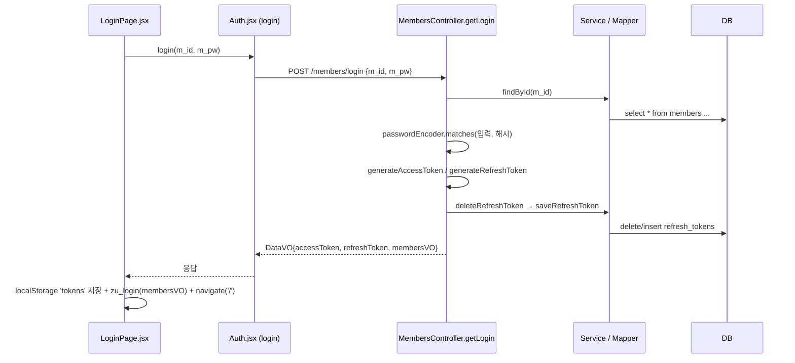
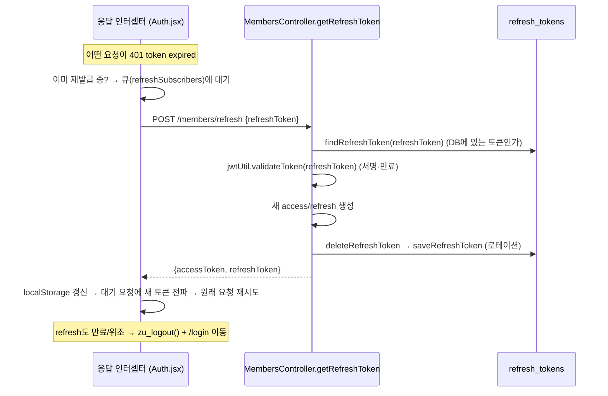

# ★ 연동 — 기능별 코드 흐름 따라가기 (파일 → 파일)

> 프론트: [`code/react/03-integration-my-app03`](https://github.com/notetester/REACT/tree/main/code/react/03-integration-my-app03) · 백엔드: [`code/springboot/02-integration-MyProject02`](https://github.com/notetester/REACT/tree/main/code/springboot/02-integration-MyProject02)
>
> [★ JWT 연동 흐름(개요)](react-springboot-jwt-flow.md)이 "큰 그림"이라면, 이 문서는 **각 기능을 실제 파일·메서드·SQL로 끝까지 따라가는** 코드 추적입니다. *이 파일의 이 코드 → 여기로 → 저 파일의 이 코드 → 저기로* 식으로, React와 Spring Boot 사이를 코드로 건너갑니다.

읽는 법: 각 기능마다 **① 한 줄 흐름 → ② 파일을 따라가며(번호) → ③ 실제 코드**. 화살표 `──▶`는 "여기서 다음 파일/단계로 넘어간다"는 뜻입니다.

---

## 0. 등장 파일 지도 (누가 무슨 일을 하나)

**프론트엔드 `my-app03/src/`**

| 파일 | 역할 |
|------|------|
| `api/Http.jsx` | Axios 인스턴스 1개(`baseURL`, `withCredentials`)를 만들어 공유 |
| `api/Auth.jsx` | 회원 API 함수 + **요청 인터셉터**(토큰 자동 주입) + **응답 인터셉터**(만료 시 재발급·재시도) |
| `api/GuestBook.jsx` | 방명록 API 함수(list/insert/update/delete) |
| `store/useAuthStore.jsx` | 로그인 상태(`user`, `isLoggedIn`) + `zu_login` / `zu_logout` |
| `pages/LoginPage.jsx` · `RegisterPage.jsx` | 로그인·회원가입 폼 |
| `pages/GuestBookPage.jsx` | 방명록 목록/작성/수정/삭제 화면 |
| `components/PrivateRoute.jsx` | 로그인 필요한 라우트 보호 |
| `App.js` | 라우트 정의 + 새로고침(F5) 시 로그인 복원 |

**백엔드 `MyProject02`**

| 파일 | 역할 |
|------|------|
| `config/SecurityConfig.java` | CORS·CSRF·STATELESS, `permitAll`/`authenticated`, 필터 등록 |
| `common/jwt/JwtRequestFilter.java` | **매 요청** `Authorization` 토큰 검증 → `SecurityContext`에 사용자 등록 |
| `common/jwt/JwtUtil.java` | 토큰 생성(`generate…`) / 검증(`validateToken`) |
| `members/controller/MembersController.java` | `/members/*` 엔드포인트 |
| `members/service/MembersServiceImpl.java` | 회원 로직(대부분 Mapper에 위임) |
| `resources/mapper/members-mapper.xml` | 회원 SQL |
| `guestbook/controller/GuestBookController.java` | `/guestbook/*` 엔드포인트 |
| `resources/mapper/guestbook-mapper.xml` | 방명록 SQL |
| `common/vo/DataVO.java` | 공통 응답 래퍼 `{success, message, data}` |

---

## 1. 모든 요청에 공통으로 적용되는 3가지 (먼저 이해)

기능별 흐름을 보기 전에, **거의 모든 요청이 똑같이 거치는 3개의 길목**을 먼저 잡으면 나머지가 쉽습니다.

### (가) 출발 — Axios 인스턴스 `api/Http.jsx`
모든 API 함수는 이 인스턴스 하나를 공유합니다.
```jsx
export const api = axios.create({
  baseURL: process.env.REACT_APP_API_BASE_URL || 'http://localhost:8080',
  headers: { 'Content-Type': 'application/json' },
  withCredentials: true,     // CORS 환경에서 인증 정보 허용
})
```

### (나) 나갈 때 — 요청 인터셉터 `api/Auth.jsx` (토큰 자동 부착)
`login/register/refresh`를 **제외한** 모든 요청에 `Authorization: Bearer <accessToken>`을 자동으로 붙입니다.
```jsx
api.interceptors.request.use((config) => {
  const exludePaths = ['/members/login', '/members/register', '/members/refresh']
  const isExcluded = exludePaths.some((path) => config.url.includes(path))
  if (!isExcluded) {
    const tokens = localStorage.getItem('tokens')
    if (tokens) {
      const parsed = JSON.parse(tokens)
      if (parsed?.accessToken) config.headers.Authorization = `Bearer ${parsed.accessToken}`  // ──▶ 서버로
    }
  }
  return config
})
```

### (다) 서버 입구 — `SecurityConfig` → `JwtRequestFilter`
서버에 도착한 요청은 **컨트롤러 전에** 보안 필터를 지납니다.
```java
// SecurityConfig.java — 어떤 경로가 토큰 없이 통과되는가
.requestMatchers("/members/login", "/members/register", "/members/refresh").permitAll()
.requestMatchers(HttpMethod.GET, "/guestbook/list").permitAll()
.anyRequest().authenticated()                          // 그 외는 인증 필요
.exceptionHandling(e -> e.authenticationEntryPoint(... 401 "인증이 필요합니다." ...))
.addFilterBefore(jwtRequestFilter, UsernamePasswordAuthenticationFilter.class);   // 필터를 앞에 삽입
```
```java
// JwtRequestFilter.java — 토큰이 있으면 검증해서 "누구인지"를 등록
String authHeader = request.getHeader("Authorization");
if (authHeader == null || !authHeader.startsWith("Bearer ")) { filterChain.doFilter(...); return; } // 토큰 없음 → 통과(공개경로는 OK, 보호경로는 뒤에서 401)
String token = authHeader.substring(7);                 // "Bearer " 제거
String userId = jwtUtil.validateToken(token);
if (userId != null) {
  var auth = new UsernamePasswordAuthenticationToken(userId, null, List.of());
  SecurityContextHolder.getContext().setAuthentication(auth);   // ──▶ 컨트롤러가 꺼내 쓸 "현재 사용자"
} // userId == null → 401 "token invalid" / ExpiredJwtException → 401 "token expired"
```

!!! tip "왜 만료(expired)와 위조(invalid)를 구분하나"
    `JwtUtil.validateToken`은 **만료면 `ExpiredJwtException`을 그대로 던지고, 위조·형식오류면 `null`을 반환**합니다. 그래서 필터는 만료 → `token expired`(클라이언트가 재발급 시도), 위조 → `token invalid`(재발급 불가)로 **다르게** 응답합니다. 이 차이가 5번 자동 재발급의 출발점입니다.

---

## 2. 기능: 회원가입 (공개)

**한 줄 흐름:** `RegisterPage` → `Auth.register` → (서버) `MembersController.getRegister` → 비번 암호화 → `Service` → `Mapper(insert)` → DB → 성공 시 `/login`으로 이동

**파일을 따라가며**

1. **`pages/RegisterPage.jsx`** — 폼 제출 → `register(formData)`
   ```jsx
   const response = await register(formData)        // ──▶ api/Auth.jsx
   const { success, message } = response.data
   if (success) navigate('/login')                  // 가입 성공 → 로그인 화면으로
   ```
2. **`api/Auth.jsx`** — POST 요청(요청 인터셉터 **제외** 경로라 토큰 안 붙음)
   ```jsx
   export const register = (member) => api.post('/members/register', member)   // ──▶ 서버 :8080
   ```
3. **(서버) `SecurityConfig`** — `/members/register`는 `permitAll` → 필터 통과 → 컨트롤러로
4. **`MembersController.getRegister()`** — **비밀번호를 해시로 바꾼 뒤** 저장
   ```java
   mvo.setM_pw(passwordEncoder.encode(mvo.getM_pw()));   // 평문 → BCrypt 해시
   membersService.register(mvo);                         // ──▶ ServiceImpl ──▶ Mapper
   dataVO.setSuccess(true); dataVO.setMessage("회원가입 성공");
   ```
5. **`members-mapper.xml`** — 실제 INSERT SQL
   ```xml
   <insert id="register" parameterType="MembersVO">
     insert into members(m_idx, m_id, m_pw, m_name, m_addr, m_email, m_phone)
     values(seq_members.nextval, #{m_id}, #{m_pw}, #{m_name}, #{m_addr}, #{m_email}, #{m_phone})
   </insert>
   ```

> 핵심: **비밀번호 암호화는 컨트롤러에서**(`passwordEncoder.encode`) 일어나 DB에는 해시만 저장됩니다. 그래서 로그인 때 `matches`로 비교만 합니다(복호화하지 않음).

---

## 3. 기능: 로그인 (공개) — 토큰이 발급되는 시작점

**한 줄 흐름:** `LoginPage` → `Auth.login` → (서버) `Controller.getLogin` → 아이디조회 → 비번검증 → 토큰 2개 생성 → refresh를 DB 저장 → 응답 → `LoginPage`가 localStorage·Zustand에 저장



**파일을 따라가며**

1. **`pages/LoginPage.jsx`** `handleSubmit()`
   ```jsx
   const response = await login(formData.m_id, formData.m_pw)   // ──▶ api/Auth.jsx
   const { success, message, data } = response.data
   ```
2. **`api/Auth.jsx`** — POST(제외 경로 → 토큰 안 붙음)
   ```jsx
   export const login = (m_id, m_pw) => api.post('/members/login', {m_id, m_pw})   // ──▶ 서버
   ```
3. **(서버) `MembersController.getLogin()`**
   ```java
   MembersVO membersVO = membersService.findById(mvo.getM_id());      // ──▶ Mapper findById
   if (membersVO == null) return DataVO(false, "없는 아이디 입니다");
   if (!passwordEncoder.matches(mvo.getM_pw(), membersVO.getM_pw()))  // 해시 비교
       return DataVO(false, "비밀번호가 틀렸습니다.");
   String accessToken  = jwtUtil.generateAccessToken(membersVO.getM_id());    // ──▶ JwtUtil
   String refreshToken = jwtUtil.generateRefreshToken(membersVO.getM_id());
   membersService.deleteRefreshToken(membersVO.getM_id());            // 기존 refresh 삭제(중복로그인 방지)
   membersService.saveRefreshToken(refreshTokenVO);                   // 새 refresh → refresh_tokens 저장
   map.put("accessToken", accessToken);
   map.put("refreshToken", refreshToken);
   map.put("membersVO", toPublicMember(membersVO));                   // 비번 해시는 빼고 공개 정보만
   dataVO.setData(map);
   ```
4. **`members-mapper.xml`** — 로그인이 거치는 SQL들
   ```xml
   <select id="findById" parameterType="String" resultType="MembersVO">
     select * from members where m_active = 0 and m_id=#{m_id}
   </select>
   <insert id="saveRefreshToken" parameterType="RefreshTokenVO">
     insert into refresh_tokens (rt_idx, rt_user_id, rt_token)
     values(seq_refresh_tokens.nextval, #{rt_user_id}, #{rt_token})
   </insert>
   ```
5. **다시 `pages/LoginPage.jsx`** — 받은 토큰을 저장(여기서부터 "로그인된 상태")
   ```jsx
   const { accessToken, refreshToken, membersVO } = data
   localStorage.setItem('tokens', JSON.stringify({ accessToken, refreshToken, user: membersVO }))
   zu_login(membersVO)        // ──▶ store/useAuthStore.jsx (isLoggedIn=true, user=membersVO)
   navigate("/")
   ```

> 두 개의 토큰: **accessToken**(짧음, 매 요청에 사용) + **refreshToken**(김, 재발급 전용 · 서버 DB에도 보관). refresh를 DB에 저장하므로 서버가 로그아웃·회수를 통제할 수 있습니다.

---

## 4. 기능: 인증이 필요한 요청 — "내 정보(myPage)"로 보는 토큰 사용법

로그인 뒤 보호된 API를 부르면 **토큰이 자동으로 붙고(프론트), 서버 필터가 검증해 "현재 사용자"를 만들고, 컨트롤러가 그걸 꺼내 씁니다.** 이 3단 릴레이가 핵심입니다.

**한 줄 흐름:** `ProfilePage` → `Auth.myPage` → **요청 인터셉터가 Bearer 부착** → **JwtRequestFilter가 검증→SecurityContext** → `Controller.getMyPage`가 `getPrincipal()`로 사용자 사용

**파일을 따라가며**

1. **(화면)** `myPage()` 호출
   ```jsx
   export const myPage = () => api.get('/members/myPage')   // api/Auth.jsx
   ```
2. **요청 인터셉터(`Auth.jsx`)** — `/members/myPage`는 제외 경로가 **아니므로** 토큰을 붙임
   ```jsx
   config.headers.Authorization = `Bearer ${parsed.accessToken}`   // ──▶ 서버
   ```
3. **`JwtRequestFilter.doFilterInternal()`** — 헤더의 토큰을 검증해 **누구인지**를 등록
   ```java
   String token = authHeader.substring(7);
   String userId = jwtUtil.validateToken(token);                   // 유효 → userId, 만료 → ExpiredJwtException
   var auth = new UsernamePasswordAuthenticationToken(userId, null, List.of());
   SecurityContextHolder.getContext().setAuthentication(auth);     // ──▶ 컨트롤러로
   ```
4. **`MembersController.getMyPage()`** — 필터가 넣어둔 사용자를 꺼냄
   ```java
   String userId = (String) SecurityContextHolder.getContext().getAuthentication().getPrincipal();
   MembersVO mvo = membersService.findById(userId);                // ──▶ Mapper
   dataVO.setData(toPublicMember(mvo));                            // 비번 빼고 반환
   ```

> 컨트롤러는 토큰을 직접 파싱하지 않습니다. **필터가 미리 `SecurityContext`에 넣어 둔 `userId`를 `getPrincipal()`로 꺼내 쓸 뿐**입니다. (토큰이 없거나 만료면 컨트롤러까지 오지 못하고 필터/엔트리포인트가 401)

---

## 5. 기능: Access Token 만료 → 자동 재발급 (가장 정교한 부분)

accessToken이 만료되면 서버가 **401 `token expired`**를 줍니다. 프론트 **응답 인터셉터**가 이걸 잡아 ① refreshToken으로 새 토큰을 받고 ② **원래 요청을 새 토큰으로 재시도**합니다. 동시에 여러 요청이 401을 받아도 **재발급은 딱 1번**만 하도록 잠금(`isRefreshing`)과 대기 큐(`refreshSubscribers`)를 씁니다.



**프론트 `api/Auth.jsx` 응답 인터셉터**
```jsx
api.interceptors.response.use((res) => res, async (error) => {
  const { config, response } = error
  if (!config) return Promise.reject(error)
  // refresh·logout 요청의 에러는 재시도 금지(무한루프 방지)
  if (['/members/refresh','/members/logout'].some(p => config.url.includes(p))) return Promise.reject(error)

  if (response?.status === 401 && !config._retry) {
    config._retry = true
    if (isRefreshing) {                       // 이미 재발급 중 → 끝나면 재시도하도록 큐에 등록
      return new Promise((resolve, reject) => refreshSubscribers.push({ config, resolve, reject }))
    }
    isRefreshing = true
    try {
      const parsed = JSON.parse(localStorage.getItem('tokens') || '{}')
      const res = await api.post('/members/refresh', { refreshToken: parsed.refreshToken })   // ──▶ 서버
      const { data } = res.data
      if (!data?.accessToken) throw new Error('AccessToken 발급 실패')
      localStorage.setItem('tokens', JSON.stringify({ ...parsed, accessToken: data.accessToken, refreshToken: data.refreshToken }))
      isRefreshing = false
      onRefreshed(data.accessToken)           // 대기 큐의 요청들에 새 토큰 전파 → 각자 재시도
      config.headers.Authorization = `Bearer ${data.accessToken}`
      return api(config)                      // 현재 요청 재시도
    } catch (e) {
      isRefreshing = false; onRefreshFailed(e)
      useAuthStore.getState().zu_logout()     // refresh도 실패 → 완전 로그아웃
      window.location.href = `${process.env.PUBLIC_URL || ''}/login`
      return Promise.reject(e)
    }
  }
  return Promise.reject(error)
})
```

**서버 `MembersController.getRefreshToken()`** — 단계가 그대로 코드에 번호로 있습니다
```java
String refreshToken = body.get("refreshToken");                       // ① 추출
if (refreshToken == null || refreshToken.isBlank()) return DataVO(false, "refreshToken이 없네요"); // ②
RefreshTokenVO storeToken = membersService.findRefreshToken(refreshToken);   // ③ DB에 있는 토큰인가
if (storeToken == null) return DataVO(false, "유효하지 않는 refreshToken 입니다.");
String userId = jwtUtil.validateToken(refreshToken);                  // ④ 서명·만료 검증
if (userId == null) return DataVO(false, "유효하지 않는 refreshToken 입니다.");
String newAccessToken  = jwtUtil.generateAccessToken(userId);         // ⑤ 새 토큰 2개
String newRefreshToken = jwtUtil.generateRefreshToken(userId);
membersService.deleteRefreshToken(userId);                            // ⑥ 로테이션: 기존 삭제
membersService.saveRefreshToken(newToken);                            //    새 refresh 저장
dataVO.setData(map{accessToken, refreshToken});                       // ⑦ 반환
// ── refreshToken 자체가 만료면 ──
catch (ExpiredJwtException e) {
  String userId = e.getClaims().getSubject();
  membersService.deleteRefreshToken(userId);                          // DB에서도 제거
  return DataVO(false, "refreshToken 만료, 다시 로그인 해주세요");
}
```

> **두 겹의 안전장치**: ③ "DB에 저장된 토큰인가"(서버가 회수 가능) + ④ "JWT 서명·만료가 맞나". 둘 다 통과해야 재발급합니다. 재발급 때마다 **refreshToken을 새것으로 교체(로테이션)**하므로 탈취된 옛 refresh는 곧 무효가 됩니다.

---

## 6. 기능: 방명록 — 목록(공개) · 작성/수정/삭제(인증·소유권)

### 6-1. 목록 보기 (공개 GET)

**한 줄 흐름:** `GuestBookPage.fetchList` → `GuestBook.guestbookList` → (서버, `permitAll`) `Controller.getGuestBooklist` → `Service` → `Mapper(select)` → DB

```jsx
// pages/GuestBookPage.jsx — 화면이 뜨면 목록부터
useEffect(() => { fetchList() }, [fetchList])
const res = await guestbookList()                         // ──▶ api/GuestBook.jsx
if (res.data.success && res.data.data) setGuestbooks(res.data.data)   // ──▶ store/useGuestbookStore
```
```jsx
// api/GuestBook.jsx
export const guestbookList = () => api.get('/guestbook/list')   // GET이라 permitAll → 토큰 없어도 됨
```
```xml
<!-- guestbook-mapper.xml : g_pwd(비밀번호)는 SELECT에 없음 → 응답에 안 나감 -->
<select id="guestBookList" resultType="GuestBookVO">
  select g_idx, g_writer, g_subject, g_email, g_content, g_regdate, g_active, f_name
  from guestbook where g_active = 0 order by g_idx asc
</select>
```

### 6-2. 작성 (인증 필요)

**한 줄 흐름:** `handleAdd` → `guestbookInsert` → **요청 인터셉터가 Bearer 부착** → `Controller.getGuestBookInsert` → `Service` → `Mapper(insert)`

```jsx
// pages/GuestBookPage.jsx — 작성자·이메일은 로그인 정보(user)에서 채움
await guestbookInsert({
  g_writer: user.m_name, g_subject: subject, g_content: content,
  g_email: user.m_email, g_pwd: pwd,
})                                                        // ──▶ POST /guestbook/insert (인증 필요)
fetchList()                                               // 등록 후 목록 갱신
```
```java
// GuestBookController.getGuestBookInsert
int result = guestBookService.guestBookInsert(gvo);       // ──▶ Mapper insert
// result == 0 → "등록 실패" / 그 외 → "등록 성공"
```

### 6-3. 수정·삭제 (인증 + **소유권 검사**)

여기서 "소유권"이 코드로 어떻게 드러나는지가 포인트입니다.

```jsx
// 수정: 작성자 이름과 비번을 함께 보냄
await guestbookUpdate({ g_idx: editId, g_subject, g_content, g_writer: user.m_name, g_pwd: editPwd })
```
```xml
<!-- guestbook-mapper.xml : WHERE에 g_writer가 있어 '작성자 본인'만 수정됨 -->
<update id="guestBookUpdate" parameterType="GuestBookVO">
  update guestbook set g_subject=#{g_subject}, g_content=#{g_content}
  where g_idx = #{g_idx} and g_writer = #{g_writer} and g_active = 0
</update>
```
> 다른 사람 글이면 `WHERE`에 안 걸려 **수정 행 수가 0** → 컨트롤러가 `result == 0`을 보고 "수정 실패"를 반환합니다. (UI에서도 `user.m_name === g.g_writer`일 때만 수정/삭제 버튼을 보여줍니다.)

```xml
<!-- 삭제는 소프트 삭제(g_active=1로 변경) -->
<update id="guestBookDelete" parameterType="GuestBookVO">
  update guestbook set g_active = 1 where g_idx = #{g_idx}
</update>
```

!!! warning "학습 코드에서 발견되는 실제 차이 (정직한 관찰)"
    프론트는 삭제 시 비밀번호(`g_pwd`)를 입력받아 보내지만, **삭제 SQL은 `where g_idx`만** 쓰고 비번·작성자를 확인하지 않습니다. 즉 현재 구현의 삭제 권한 통제는 "로그인 필요(인증)"까지이고, **글 단위 소유권 검사는 수정에만** 들어 있습니다. 운영용으로 다듬을 때는 삭제에도 `and g_writer = #{g_writer}` 같은 조건을 더하는 것이 좋습니다. → [Spring 04 — REST API 품질](../springboot/04-rest-api-quality.md)

---

## 7. 기능: 로그아웃 · 회원수정 · 회원탈퇴 (인증, 짧게)

세 기능 모두 **요청 인터셉터(Bearer) → 필터(검증·SecurityContext) → 컨트롤러가 `getPrincipal()`로 본인 확인**이라는 같은 골격입니다.

| 기능 | 프론트 호출 | 서버 컨트롤러가 하는 일 |
|------|------------|------------------------|
| 로그아웃 | `logout()` → `POST /members/logout` | `getPrincipal()` → `deleteRefreshToken(userId)` (DB의 refresh 제거). accessToken은 프론트 `zu_logout()`이 localStorage에서 삭제 |
| 회원수정 | `updateMember(m)` → `POST /members/updateMember` | `mvo.setM_id(getPrincipal())` 로 **본인 아이디 강제** 후 `updateMember`(`where m_id and m_active=0`) |
| 회원탈퇴 | `deleteMember()` → `DELETE /members/delAccount` | `deleteRefreshToken` + `deleteAccount` (소프트 삭제 `m_active=1`) |

```java
// 공통 패턴 — 컨트롤러는 "토큰의 주인"만 신뢰한다 (요청 body의 m_id를 안 믿음)
String userId = (String) SecurityContextHolder.getContext().getAuthentication().getPrincipal();
mvo.setM_id(userId);     // 회원수정: 남의 아이디로 바꿔 보내도 본인 것만 수정됨
```
```jsx
// store/useAuthStore.jsx — 로그아웃은 토큰을 지우고 상태를 되돌림
zu_logout: () => { localStorage.removeItem('tokens'); set({ isLoggedIn:false, user:null }) }
```

새로고침(F5) 시 로그인 유지는 **`App.js`의 `useEffect`**가 담당합니다.
```jsx
useEffect(() => {
  const stored = localStorage.getItem('tokens')
  if (stored) useAuthStore.getState().zu_login(JSON.parse(stored).user || null)  // 상태 복원
}, [])
```
보호 라우트는 **`PrivateRoute`**가 막습니다.
```jsx
const hasTokens = !!localStorage.getItem('tokens')
return (isLoggedIn || hasTokens) ? children : <Navigate to="/login" replace />
```

---

## 8. 한눈에 보기 — 기능 ↔ 파일 ↔ 메서드 ↔ SQL

| 기능 | 프론트 (파일·함수) | 서버 (Controller 메서드) | Service/Mapper · SQL | 인증 |
|------|--------------------|--------------------------|----------------------|:---:|
| 회원가입 | `RegisterPage` → `Auth.register` | `getRegister` (`encode` 후) | `register` · `insert members` | ✗ |
| 로그인 | `LoginPage` → `Auth.login` | `getLogin` | `findById`·`saveRefreshToken` | ✗ |
| 토큰 재발급 | `Auth.jsx` 응답 인터셉터 | `getRefreshToken` | `findRefreshToken`·로테이션 | ✗ |
| 내 정보 | `Auth.myPage` | `getMyPage` (`getPrincipal`) | `findById` | ✅ |
| 회원수정 | `Auth.updateMember` | `updateMember` | `updateMember` (`where m_id`) | ✅ |
| 회원탈퇴 | `Auth.deleteMember` | `getDelAccount` | `deleteAccount` (`m_active=1`) | ✅ |
| 로그아웃 | `Auth.logout` | `getLogout` | `deleteRefreshToken` | ✅ |
| 방명록 목록 | `GuestBook.guestbookList` | `getGuestBooklist` | `guestBookList` (`g_active=0`) | ✗(GET) |
| 방명록 작성 | `GuestBook.guestbookInsert` | `getGuestBookInsert` | `guestBookInsert` | ✅ |
| 방명록 수정 | `GuestBook.guestbookUpdate` | `getGuestBookDetail` | `guestBookUpdate` (`+g_writer`) | ✅ |
| 방명록 삭제 | `GuestBook.guestbookDelete` | `getGuestBookDelete` | `guestBookDelete` (`g_active=1`) | ✅ |

> 인증 ✅ 요청은 모두 **요청 인터셉터(Bearer) → `JwtRequestFilter`(검증) → `getPrincipal()`** 를 공통으로 거칩니다(§1·§4). 공개 ✗ 요청은 `SecurityConfig`의 `permitAll`로 필터를 그냥 지납니다.

---

### 관련 문서
- [★ JWT 연동 흐름 (개요·다이어그램)](react-springboot-jwt-flow.md)
- [Spring Boot 02 — Spring Security](../springboot/02-spring-security.md) · [03 — JWT](../springboot/03-jwt.md) · [04 — REST API 품질](../springboot/04-rest-api-quality.md)
- [React 09 — Fetch/Axios](../react/09-fetch-axios.md) · [React 11 — Zustand 인증·CRUD](../react/11-zustand-auth-crud.md)
- [최종 홈페이지 완성 로드맵](final-homepage-roadmap.md)
