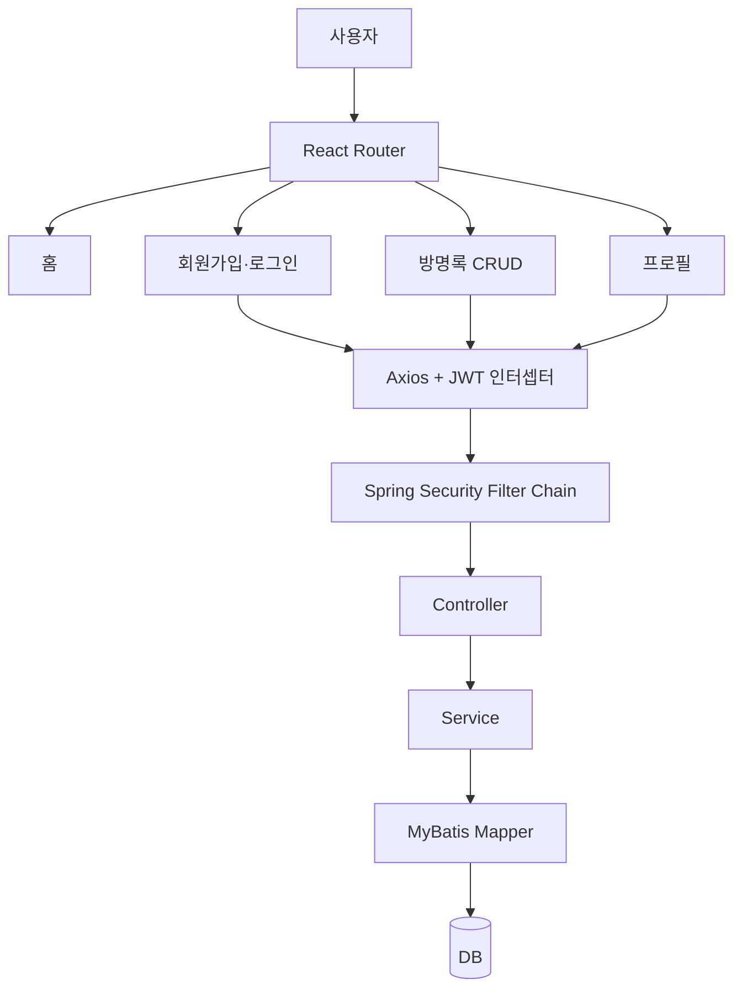

# 최종 프로젝트 — 간단한 홈페이지 완성 로드맵

> 목표: React를 처음 배운 사람이 Spring Boot와 DB까지 연결하여 **작지만 끝까지 동작하는 홈페이지**를 직접 완성합니다.
>
> 완성 예시는 [`my-app03`](https://github.com/notetester/REACT/tree/main/code/react/03-integration-my-app03) ↔ [`MyProject02`](https://github.com/notetester/REACT/tree/main/code/springboot/02-integration-MyProject02)입니다.

## 1. 완성할 홈페이지의 범위

처음부터 쇼핑몰이나 대규모 커뮤니티를 만들지 않습니다. 인증과 CRUD의 핵심을 모두 포함하면서도 한 사람이 전체 흐름을 이해할 수 있는 범위를 선택합니다.

| 화면 | 비로그인 | 로그인 | 핵심 학습 |
|---|---:|---:|---|
| 홈 | 조회 | 조회 | 레이아웃, Router |
| 회원가입 | 가능 | 가능 | form, POST, 입력 검증 |
| 로그인 | 가능 | 상태 표시 | JWT 발급, Zustand |
| 방명록 목록 | 가능 | 가능 | GET, 배열 렌더링 |
| 방명록 등록 | 불가 | 가능 | 보호 API, POST |
| 방명록 수정·삭제 | 불가 | 본인 글만 | 조건부 렌더링, CRUD |
| 프로필 | 불가 | 가능 | 보호 라우트, GET, 수정 |



## 2. 학습 순서: 한 번에 한 층씩 올립니다

### 단계 0. 도구 준비

먼저 브라우저, Node.js, Java 21, Git, DB 클라이언트를 준비합니다.

```bash
node -v
npm -v
java -version
git --version
```

Spring Boot 실습 전에 [Windows 로컬 DB 설치](../guide/02-local-db-setup.md)를 따라갑니다.

**완료 기준**

- React 개발 서버를 열 수 있다.
- `./gradlew build` 또는 Windows의 `.\gradlew.bat build`가 실행된다.
- MySQL 또는 Oracle에서 `study` 계정을 조회할 수 있다.

### 단계 1. 정적 화면을 컴포넌트로 나눕니다

처음에는 서버를 연결하지 않습니다.

```text
App
├── Navbar
├── HomePage
├── LoginPage
├── RegisterPage
├── GuestBookPage
└── ProfilePage
```

질문:

1. 여러 화면에 반복되는 부분은 무엇인가?
2. 페이지와 재사용 컴포넌트의 경계는 어디인가?
3. 데이터가 아직 없어도 어떤 레이아웃이 보여야 하는가?

**완료 기준**

- 모든 페이지를 직접 열 수 있다.
- 네비게이션이 공통 컴포넌트다.
- 입력 폼의 `label`, `placeholder`, 버튼 이름이 분명하다.

### 단계 2. Router로 URL을 부여합니다

```jsx
<Routes>
  <Route path="/" element={<HomePage />} />
  <Route path="/login" element={<LoginPage />} />
  <Route path="/register" element={<RegisterPage />} />
  <Route path="/guestbook" element={<GuestBookPage />} />
  <Route path="/profile" element={<PrivateRoute><ProfilePage /></PrivateRoute>} />
</Routes>
```

URL이 있어야 새로고침, 북마크, 링크 공유, 뒤로 가기가 자연스럽습니다. 로컬 서버는 `BrowserRouter`, 정적 GitHub Pages 데모는 `HashRouter`를 사용합니다.

**완료 기준**

- 메뉴를 누르면 URL이 바뀐다.
- 존재하지 않는 경로를 어떻게 처리할지 설명할 수 있다.
- 보호 페이지에 비로그인 접근 시 로그인으로 이동한다.

### 단계 3. 프론트 상태만으로 작은 기능을 완성합니다

Todo와 Memo로 상태 변경을 연습합니다.

```jsx
setTodos(prev => [...prev, newTodo])
setTodos(prev => prev.filter(todo => todo.id !== targetId))
setTodos(prev => prev.map(todo =>
  todo.id === targetId ? { ...todo, done: !todo.done } : todo
))
```

여기서 배워야 할 것은 문법만이 아닙니다.

- state를 직접 변경하지 않는다.
- 계산 가능한 값은 렌더링 중 계산한다.
- 지역 상태와 전역 상태를 구분한다.
- 새로고침 후 유지할 값만 localStorage에 저장한다.

**완료 기준**

- 추가·수정·삭제 후 화면이 즉시 바뀐다.
- `push` 대신 새 배열을 만드는 이유를 설명할 수 있다.
- 어떤 값을 Zustand에 둘지 판단할 수 있다.

### 단계 4. API 계약을 먼저 적습니다

프론트와 백엔드를 동시에 만들기 전에 요청과 응답을 표로 고정합니다.

| 기능 | 요청 | 인증 | 응답 핵심 |
|---|---|:---:|---|
| 회원가입 | `POST /members/register` | X | 성공 여부 |
| 로그인 | `POST /members/login` | X | access, refresh, 사용자 공개 정보 |
| 재발급 | `POST /members/refresh` | X | 새 access, refresh |
| 내 프로필 | `GET /members/myPage` | O | 사용자 공개 정보 |
| 프로필 수정 | `POST /members/updateMember` | O | 성공 여부 |
| 회원탈퇴 | `DELETE /members/delAccount` | O | 성공 여부 |
| 방명록 목록 | `GET /guestbook/list` | X | 글 배열 |
| 등록·수정·삭제 | `POST /guestbook/*` | O | 성공 여부 |

!!! tip "응답에서 먼저 제외할 것"
    회원 비밀번호 해시, 방명록 비밀번호 해시, JWT 서명 키, DB 비밀번호는 브라우저 응답에 포함하지 않습니다.

**완료 기준**

- Postman 또는 curl로 각 요청을 설명할 수 있다.
- 공개 API와 보호 API를 구분할 수 있다.
- 실패 응답도 계약의 일부라고 이해한다.

### 단계 5. Spring Boot 레이어를 연결합니다

```text
Controller → Service → ServiceImpl → Mapper interface → mapper.xml → DB
```

| 레이어 | 질문 |
|---|---|
| Controller | 어떤 URL과 HTTP 메서드인가? |
| Service | 어떤 업무 규칙을 적용하는가? |
| Mapper | 어떤 SQL을 실행하는가? |
| DB | 어떤 테이블과 시퀀스가 필요한가? |

처음에는 `GET /guestbook/list` 하나만 완성하세요. 그다음 등록, 상세, 수정, 삭제 순서로 늘립니다.

**완료 기준**

- DB에 넣은 글이 API 목록에 보인다.
- Mapper XML의 SQL과 브라우저 응답을 연결해 설명할 수 있다.
- 서버 로그에서 오류 원인을 찾을 수 있다.

### 단계 6. 비밀번호 해시와 JWT 인증을 추가합니다

회원 비밀번호는 BCrypt로 해시합니다.

```text
회원가입: 원문 비밀번호 → BCrypt encode → DB 해시 저장
로그인: 입력 원문 + DB 해시 → matches → 성공/실패
```

로그인 성공 후에는 JWT를 사용합니다.

```text
로그인 → Access Token + Refresh Token
보호 API → Authorization: Bearer <accessToken>
만료 → refresh 요청 → 새 토큰 저장 → 원래 요청 재시도
```

자세한 구현은 [JWT 인증](../springboot/03-jwt.md)과 [React ↔ Spring Boot JWT 흐름](react-springboot-jwt-flow.md)을 읽습니다.

**완료 기준**

- 로그인 전후 Navbar가 바뀐다.
- 토큰 없이 보호 API를 호출하면 401이다.
- Access Token 만료 후 재발급 흐름을 설명할 수 있다.
- 로그아웃 시 refresh token이 서버 DB에서 삭제된다.

### 단계 7. Axios 인터셉터로 반복을 줄입니다

모든 보호 요청마다 토큰 코드를 복사하지 않습니다.

```text
요청 인터셉터: 토큰이 필요한 요청에 Bearer 자동 부착
응답 인터셉터: 401이면 refresh를 한 번만 수행
대기 큐: 동시에 실패한 요청은 새 토큰을 기다렸다가 재시도
```

**완료 기준**

- 페이지 컴포넌트는 토큰 헤더 조립을 몰라도 된다.
- refresh 요청 자체가 무한 재시도되지 않는다.
- refresh도 실패하면 완전 로그아웃된다.

### 단계 8. 오류·보안·검증을 다듬습니다

[Spring Boot 04](../springboot/04-rest-api-quality.md)를 기준으로 다음을 점검합니다.

```text
□ Request DTO와 Response DTO를 분리했는가?
□ @Valid로 빈 입력과 잘못된 이메일을 막는가?
□ 401과 403을 구분하는가?
□ 응답에 비밀번호 해시가 없는가?
□ DB 비밀번호와 JWT 서명 키를 환경변수로 덮어쓸 수 있는가?
□ localStorage 토큰 방식이 학습용임을 알고 있는가?
```

## 3. 로컬, Pages, Actions를 혼동하지 마세요

| 환경 | 프론트 | 백엔드 | DB | 목적 |
|---|---|---|---|---|
| 로컬 최종 실습 | `my-app03` | `MyProject02` | Oracle XE | 실제 연동 학습 |
| Pages mock 데모 | 정적 React | 없음 | 브라우저 localStorage | 설치 없이 UI 체험 |
| Actions snapshot | 문서 생성 | `MyProject02` | 임시 H2 Oracle mode | 실제 API 자동 재현 |

- [온라인 integration 데모](/REACT/demo/integration/)
- [Actions API 실행 결과](../generated/integration-snapshot.md)
- [환경별 상세 설명](online-demo-and-snapshot.md)

## 4. 막혔을 때 확인하는 순서

| 증상 | 먼저 확인할 것 | 다음 확인 |
|---|---|---|
| React 화면이 안 열림 | `npm install`, 터미널 오류 | 포트 3000 사용 여부 |
| API 호출이 실패 | Spring 서버 8080 실행 여부 | 브라우저 Network 탭 |
| CORS 오류 | React origin이 `http://localhost:3000`인지 | `SecurityConfig` 허용 origin |
| DB 연결 실패 | DB 서비스 실행 여부 | URL, 사용자, 비밀번호 |
| 401 | access token 존재·만료 여부 | `Authorization: Bearer` 형식 |
| 로그인 실패 | `study / 1111` 계정 존재 여부 | BCrypt 해시와 `matches` |
| 새로고침 후 404 | 정적 호스팅인지 | Pages 빌드의 `HashRouter` |

## 5. 최종 점검표

```text
[화면]
□ 홈, 로그인, 회원가입, 방명록, 프로필 페이지가 있다.
□ 비로그인과 로그인 상태의 메뉴가 다르게 보인다.
□ 로딩, 빈 목록, 오류 메시지를 구분한다.

[React]
□ props와 state의 역할을 설명할 수 있다.
□ 배열과 객체 state를 불변 방식으로 업데이트한다.
□ Effect를 외부 시스템 동기화에만 사용한다.
□ Axios 인터셉터의 요청·응답 흐름을 설명할 수 있다.

[Spring Boot]
□ Controller → Service → Mapper → DB 흐름을 설명할 수 있다.
□ 공개 API와 보호 API를 구분한다.
□ 비밀번호를 BCrypt 해시로 저장한다.
□ JWT Access/Refresh 역할을 설명할 수 있다.

[실행]
□ 새 PC에서 DB 초기화 SQL을 실행할 수 있다.
□ 환경변수로 로컬 기본값을 바꿀 수 있다.
□ GitHub Actions와 로컬 DB의 차이를 설명할 수 있다.
□ Pages mock 데모와 실제 API snapshot의 차이를 설명할 수 있다.
```

## 6. 완성 후 확장 아이디어

한 번에 하나씩 추가하세요.

1. 공통 오류 응답과 입력 검증
2. 역할(`USER`, `ADMIN`)에 따른 인가
3. 페이지네이션과 검색
4. 이미지 업로드와 파일 보안
5. React 테스트와 MockMvc 테스트
6. Vite 기반 프론트 재구성
7. HTTPS, CSP, 쿠키 전략 검토
8. 배포 환경 DB와 Secret Manager 연결
