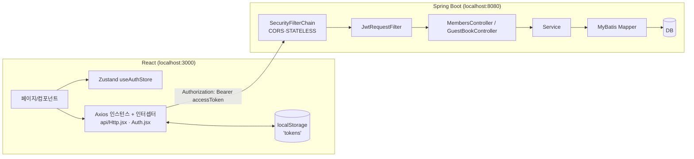
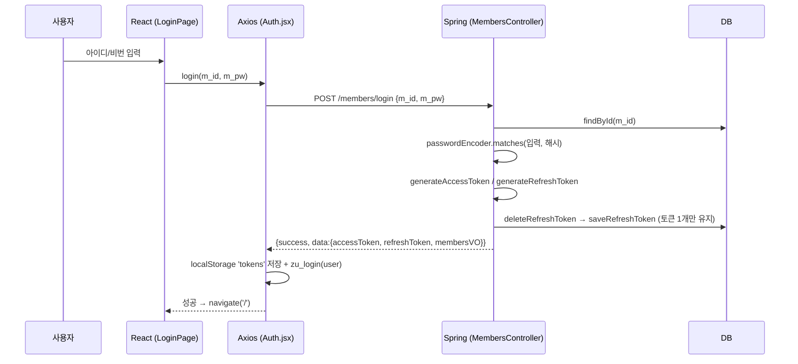
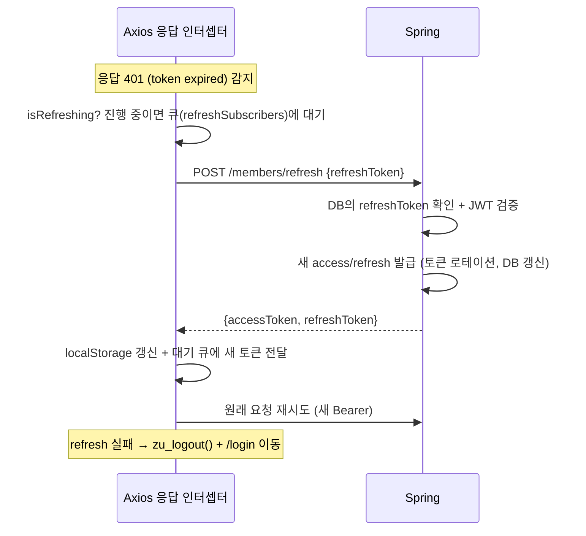

# ★ React ↔ Spring Boot — JWT 인증 연동 흐름 (최종 응용)

> 프론트: [`code/react/03-integration-my-app03`](https://github.com/notetester/REACT/tree/main/code/react/03-integration-my-app03) · 백엔드: [`code/springboot/02-integration-MyProject02`](https://github.com/notetester/REACT/tree/main/code/springboot/02-integration-MyProject02)
>
> 이 문서는 앞선 React·Spring Boot·JWT 학습이 **하나로 합쳐지는** 최종 단계입니다.
>
> 설치 없이 화면부터 확인하려면 [온라인 mock 데모와 Actions API 스냅샷](online-demo-and-snapshot.md)을 먼저 읽으세요.

---

## 1. 전체 아키텍처



- React(3000) ↔ Spring(8080)은 **출처(origin)가 다름** → 서버 `SecurityConfig`에서 CORS로 `http://localhost:3000` 허용, `allowCredentials=true`.
- 프론트 Axios도 `withCredentials: true`.
- 백엔드 DB: **MyProject02 = Oracle**(`ojdbc11`, `jdbc:oracle:thin:@localhost:1521:xe`). (MyProject01은 MySQL)

!!! info "온라인 데모와 자동 검증의 역할"
    로컬 최종 실습은 Oracle XE를 사용합니다. GitHub Pages에서는 브라우저 localStorage 기반 mock API로 화면을 체험하고, GitHub Actions에서는 H2 Oracle mode로 실제 Spring Boot API 시나리오를 실행합니다.

## 2. Axios 인스턴스 — `api/Http.jsx`
```jsx
export const api = axios.create({
  baseURL: process.env.REACT_APP_API_BASE_URL || 'http://localhost:8080',
  headers: { 'Content-Type': 'application/json' },
  withCredentials: true,                           // CORS 환경 인증 허용
})
```
> 기본 URL은 `http://localhost:8080`입니다. 다른 서버를 쓸 때는 `.env.example`을 참고해 `.env.development`에 `REACT_APP_API_BASE_URL`을 설정합니다.

## 3. 로그인 시퀀스



**서버 `POST /members/login`** (핵심):
```java
MembersVO m = membersService.findById(mvo.getM_id());
if (m == null) return DataVO(false, "없는 아이디 입니다");
if (!passwordEncoder.matches(mvo.getM_pw(), m.getM_pw())) return DataVO(false, "비밀번호가 틀렸습니다.");
String accessToken  = jwtUtil.generateAccessToken(m.getM_id());
String refreshToken = jwtUtil.generateRefreshToken(m.getM_id());
membersService.deleteRefreshToken(m.getM_id());     // 기존 삭제 (중복 로그인 방지)
membersService.saveRefreshToken(...);               // 새 refresh → DB 저장
return DataVO(true, "로그인 성공", {accessToken, refreshToken, membersVO});
```

## 4. 인증 요청 — 요청 인터셉터가 토큰 자동 주입

`api/Auth.jsx`의 **요청 인터셉터**는 `login/register/refresh`를 제외한 모든 요청에 `Authorization: Bearer <accessToken>`을 자동으로 붙입니다.
```jsx
api.interceptors.request.use((config) => {
  const exclude = ['/members/login','/members/register','/members/refresh']
  if (!exclude.some(p => config.url.includes(p))) {
    const t = JSON.parse(localStorage.getItem('tokens') || '{}')
    if (t?.accessToken) config.headers.Authorization = `Bearer ${t.accessToken}`
  }
  return config
})
```
서버 `JwtRequestFilter`가 이 토큰을 검증해 `SecurityContextHolder`에 `userId`를 넣고, 컨트롤러는 그것을 꺼내 씁니다:
```java
// 예) GET /members/myPage
String userId = (String) SecurityContextHolder.getContext().getAuthentication().getPrincipal();
```

## 5. Access Token 만료 → 자동 재발급 (응답 인터셉터)

가장 정교한 부분입니다. 401을 받으면 **Refresh Token으로 재발급 후 원래 요청을 재시도**하며, 동시에 여러 요청이 401을 받아도 **재발급은 1번만** 수행합니다.



```jsx
let isRefreshing = false
let refreshSubscribers = []          // refresh 완료를 기다리는 요청들
const onRefreshed = (t) => {
  refreshSubscribers.forEach(({ config, resolve }) => {
    config.headers.Authorization = `Bearer ${t}`
    resolve(api(config))
  })
  refreshSubscribers = []
}
const onRefreshFailed = (error) => {
  refreshSubscribers.forEach(({ reject }) => reject(error))
  refreshSubscribers = []
}

api.interceptors.response.use(res => res, async (error) => {
  const { config, response } = error
  if (response?.status === 401 && !config._retry) {
    config._retry = true
    if (isRefreshing) {              // 이미 재발급 중 → 끝나면 재시도하도록 큐에 등록
      return new Promise((resolve, reject) => {
        refreshSubscribers.push({ config, resolve, reject })
      })
    }
    isRefreshing = true
    try {
      const { refreshToken } = JSON.parse(localStorage.getItem('tokens') || '{}')
      const { data } = (await api.post('/members/refresh', { refreshToken })).data
      // 새 토큰 저장 → 대기 요청에 전파 → 현재 요청 재시도
      localStorage.setItem('tokens', JSON.stringify({ ...parsed, ...data }))
      isRefreshing = false; onRefreshed(data.accessToken)
      config.headers.Authorization = `Bearer ${data.accessToken}`
      return api(config)
    } catch (e) {
      isRefreshing = false; onRefreshFailed(e)
      useAuthStore.getState().zu_logout()
      window.location.href = `${process.env.PUBLIC_URL || ''}/login`
      return Promise.reject(e)                  // refresh도 만료 → 완전 로그아웃
    }
  }
  return Promise.reject(error)
})
```

**서버 `POST /members/refresh`**: ① body의 refreshToken 추출 → ② DB에 저장된 토큰인지 확인 → ③ JWT 서명·만료 검증 → ④ 새 access/refresh 발급 → ⑤ **토큰 로테이션**(기존 삭제 후 새 refresh 저장) → ⑥ 반환. refresh마저 만료면 DB에서 삭제하고 "다시 로그인" 유도.

## 6. 로그인 보호 라우트 — `PrivateRoute`
```jsx
export default function PrivateRoute({ children }) {
  const isLoggedIn = useAuthStore((s) => s.isLoggedIn)
  const hasTokens = !!localStorage.getItem('tokens')
  return (isLoggedIn || hasTokens) ? children : <Navigate to="/login" replace />
}
// App.js:  <Route path="/memo" element={<PrivateRoute><MemoPage/></PrivateRoute>} />
```
새로고침(F5) 시에는 `App.js`의 `useEffect`가 localStorage의 `tokens`를 읽어 `zu_login`으로 로그인 상태를 복원합니다.

## 7. 프론트 ↔ 백엔드 엔드포인트 매핑

| 기능 | 프론트(`api/`) | 백엔드(`/members`,`/guestbook`) | 인증 |
|------|----------------|-------------------------------|:---:|
| 회원가입 | `register(member)` | `POST /members/register` | ✗(공개) |
| 로그인 | `login(m_id,m_pw)` | `POST /members/login` | ✗(공개) |
| 토큰 재발급 | (인터셉터) | `POST /members/refresh` | ✗(공개) |
| 내 정보 | `myPage()` | `GET /members/myPage` | ✅ |
| 회원수정 | `updateMember(m)` | `POST /members/updateMember` | ✅ |
| 회원탈퇴 | `deleteMember()` | `DELETE /members/delAccount` | ✅ |
| 로그아웃 | `logout()` | `POST /members/logout`(DB refresh 삭제) | ✅ |
| 방명록 목록 | `guestbookList()` | `GET /guestbook/list` | ✗(공개) |
| 방명록 등록/수정/삭제 | `guestbookInsert/Update/Delete` | `POST /guestbook/*` | ✅ |

> 서버 `SecurityConfig`: `permitAll`(`/members/login,register,refresh`, `GET /guestbook/list`), 그 외 `authenticated`. `JwtRequestFilter`를 `UsernamePasswordAuthenticationFilter` 앞에 `addFilterBefore`로 삽입.

!!! warning "학습용 토큰 저장 방식"
    흐름을 쉽게 관찰하려고 토큰을 `localStorage`에 저장합니다. 실서비스에서는 XSS 대응, HTTPS, CSP, 토큰 저장 위치와 쿠키를 사용할 경우의 CSRF 방어를 함께 설계해야 합니다.

---

### 관련 문서
- [Spring Boot 03 — JWT](../springboot/03-jwt.md) · [Spring Security](../springboot/02-spring-security.md)
- [React 10 — Zustand 기초](../react/10-zustand-basics.md) · [React 09 — Fetch/Axios](../react/09-fetch-axios.md)
- [Spring Boot 04 — REST API 품질](../springboot/04-rest-api-quality.md)
- [최종 프로젝트 — 간단한 홈페이지 완성 로드맵](final-homepage-roadmap.md)
