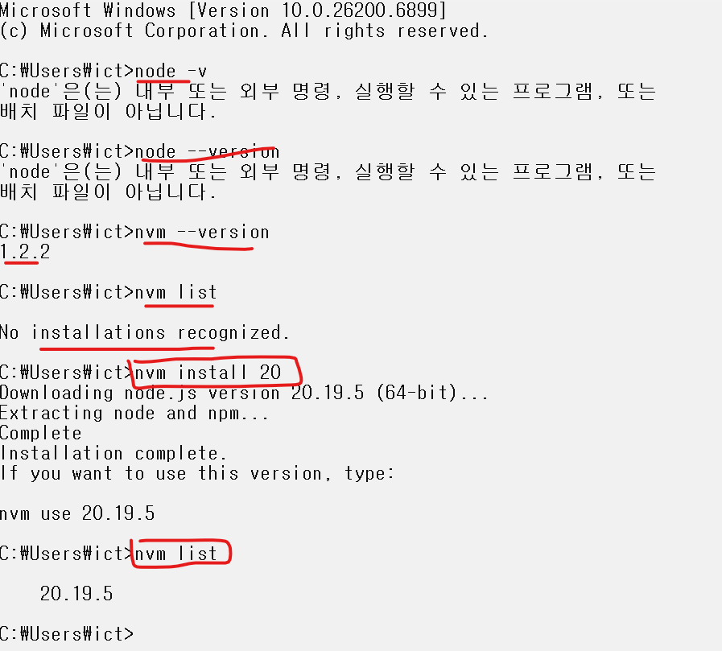
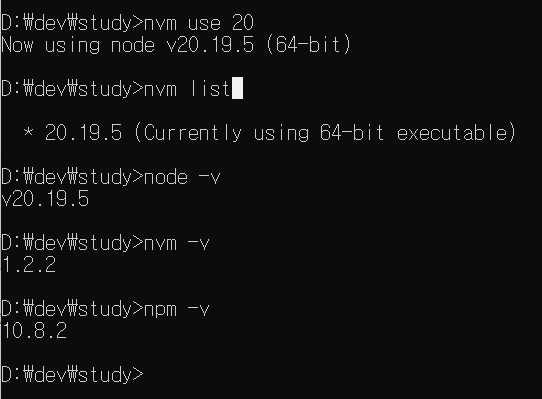
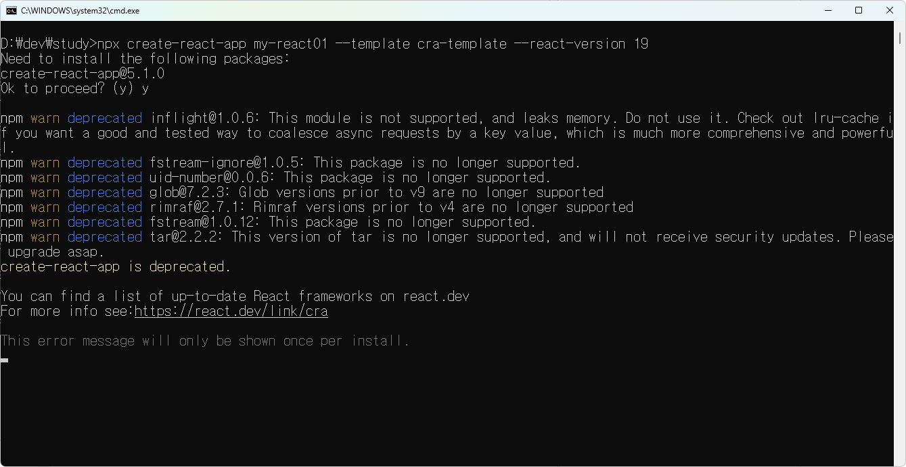
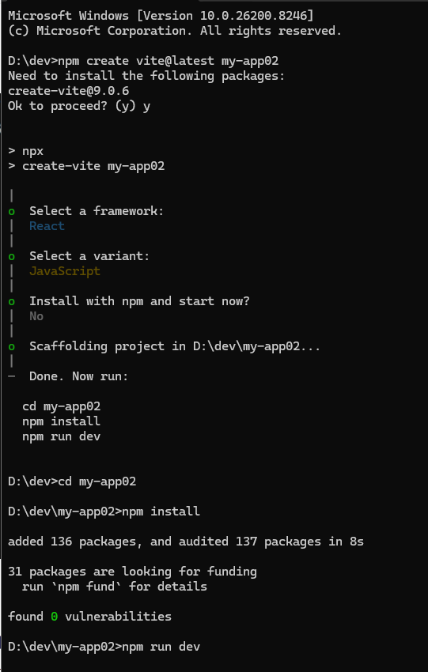
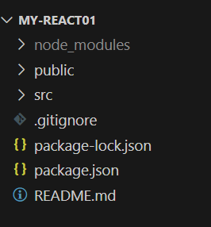
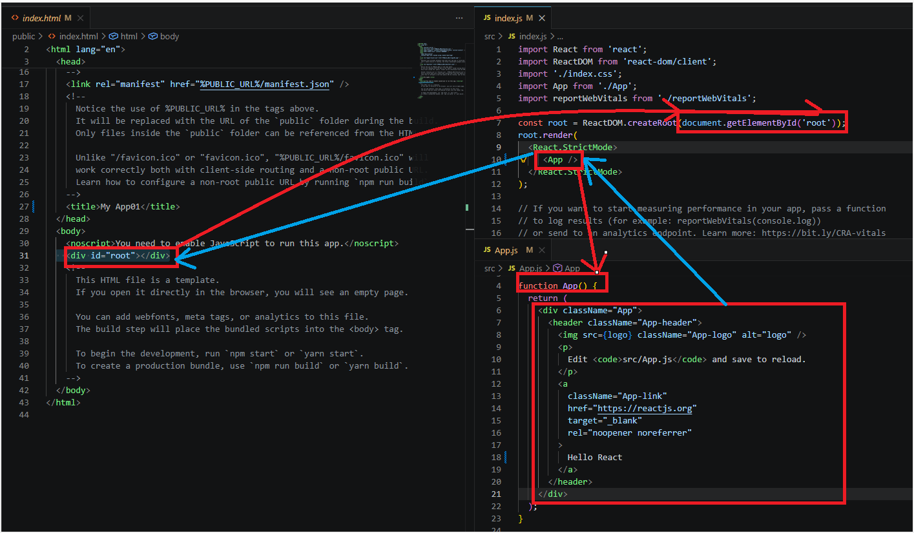
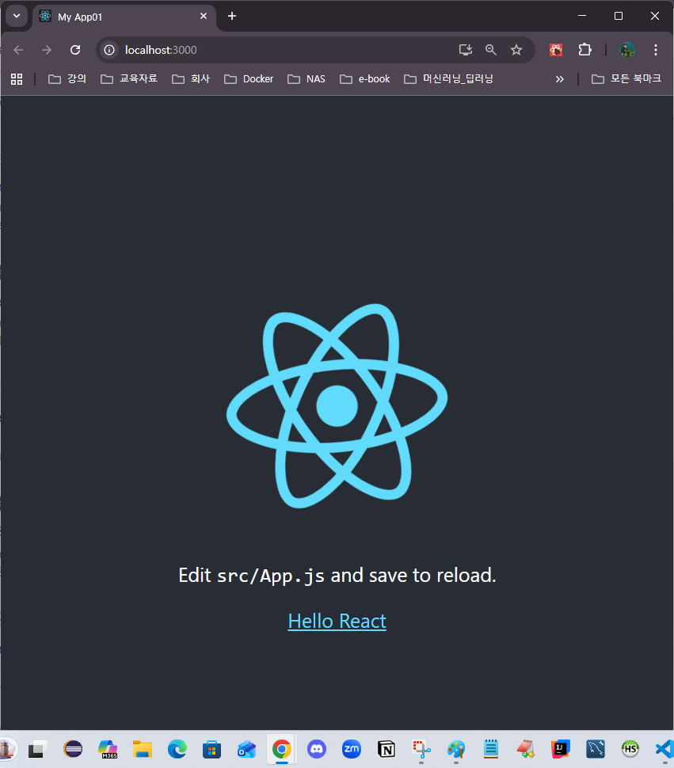

# React 01 — 소개 · 설치 · 프로젝트 구조

> 실습 코드: [`code/react/01-basics-my-app01`](https://github.com/notetester/REACT/tree/main/code/react/01-basics-my-app01)

---

## 1. React 란?

페이스북(Meta)이 만든 **자바스크립트 기반 UI 라이브러리**. 최종 프로젝트의 **화면(프론트엔드)**을 담당합니다. (Spring Boot에서 JSP 대신 React/Vue를 사용)

### 핵심 개념
- **컴포넌트 기반** — UI를 작고 독립적인 조각으로 나눠 작성 → 재사용·유지보수 용이
- **JSX (JavaScript XML)** — JS 안에서 HTML 비슷한 마크업을 사용
- **Virtual DOM** — 가상 DOM으로 변경을 추적해 **최소한의 변경만** 실제 DOM에 반영
- **단방향 데이터 흐름** — 상위 → 하위로만 데이터 전달
- **Hooks** — 함수형 컴포넌트에서 상태·생명주기 제어

### 렌더링 방식 용어
| 용어 | 의미 |
|------|------|
| CSR | Client Side Rendering — 클라이언트가 동적으로 화면 렌더링 |
| SPA | Single Page Application — 하나의 HTML로, 새로고침 없이 페이지 전환 |
| SSR | Server Side Rendering — 서버에서 먼저 렌더링(예: Next.js) |

→ React는 기본적으로 **SPA + CSR**.

## 2. 설치

1. **Node.js** 설치 (NVM 권장). React 19는 Node 18.x/20.x(LTS) 권장.
   - `nvm install 20` → `nvm use 20` → `node -v` / `npm -v`로 확인




- **NVM**: Node 버전 관리 도구 / **NPM**: 패키지 관리 도구

## 3. 프로젝트 만들기 — CRA vs Vite

| | CRA (Create React App) | Vite |
|---|---|---|
| 특징 | 전통적·보편적 구조 | 빠르고 가벼운 빌드 도구 |
| 생성 | `npx create-react-app my-app01 --template cra-template --react-version 19` | `npm create vite@latest my-app02` |
| 실행 | `npm start` → :3000 | `npm install` → `npm run dev` → :5173 |




> 본 실습의 `my-app01/02/03`은 모두 **CRA(react-scripts)** 기반입니다.

### 프로젝트 구조


| 폴더/파일 | 역할 |
|-----------|------|
| `node_modules/` | 설치된 라이브러리. 직접 수정 X, Git 제외(용량 큼), `npm install`로 재생성 |
| `public/index.html` | 단 하나의 HTML 껍데기 (`<div id="root">`) |
| `src/` | 실제 소스 코드 (`App.js` 루트 컴포넌트, `index.js` 진입점) |
| `package.json` | 메타정보 + 의존성 + 스크립트 |
| `package-lock.json` | 의존성 잠금 스냅샷 (동일 버전 재현) |
| `.gitignore` | Git 제외 목록 |
| `components/` | 재사용 공통 컴포넌트 (Button, Header, Modal…) |
| `pages/` | 화면 단위(라우터와 연결되는 페이지) |

## 4. 실행 흐름 — index.html → index.js → App.js

```
index.html (HTML 뼈대) → index.js (진입점) → App.js (화면 구성)
```
`index.js`가 `id="root"`를 찾아 `<App />`을 렌더링합니다.
```jsx
const root = ReactDOM.createRoot(document.getElementById('root'));
root.render(<React.StrictMode><App /></React.StrictMode>);
```
> `<React.StrictMode>`는 개발 중에만 동작하는 경고 도우미(배포 시 영향 없음).




## 5. JSX 규칙 (8가지)

1. **컴포넌트 = 마크업을 반환하는 함수.** 통합형 `export default function 이름(){ return(...) }` 권장
2. **단일 루트 요소 반환** — 최상위 태그는 하나 (`<div>` 또는 Fragment `<>...</>`)
3. **모든 태그는 닫기** — ``,`<br>`,`<input>` → ``,`<br />`,`<input />`
4. **`class` → `className`**
5. **속성은 camelCase** — `onClick`, `onChange`
6. **컴포넌트 이름은 대문자로 시작** (HTML 태그와 구분)
7. `return` 뒤 `()` 없이 줄바꿈하면 `undefined` 반환됨(주의)
8. **컴포넌트 호출은 OK, 정의 중첩은 금지** — 컴포넌트 안에 다른 컴포넌트를 `function`으로 정의하지 말 것

---
### 다음 단계
- [React 02 — JSX와 컴포넌트](02-jsx-components.md)
