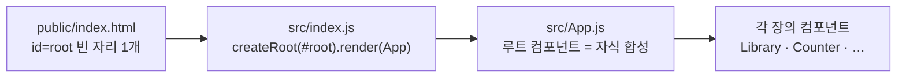

# React 01 — 소개 · 설치 · 프로젝트 구조

> 실습 코드: [`code/react/01-basics-my-app01`](https://github.com/notetester/REACT/tree/main/code/react/01-basics-my-app01)

---

## 먼저 결과부터 둘러보세요

React는 화면을 만들기 위한 라이브러리입니다. 처음부터 모든 코드를 이해하려고 멈추기보다, 아래 결과 탐색기에서 탭을 누르고 화면을 조작한 뒤 각 장의 코드를 읽으세요.

<div class="react-live-preview">
  <iframe
    class="react-live-frame react-live-frame--tall"
    src="/REACT/demo/react-basics/#/lab"
    title="React 단계별 실습 결과 탐색기"
    loading="lazy">
  </iframe>
</div>

<p class="react-live-links">
  <a href="/REACT/demo/react-basics/#/lab" target="_blank" rel="noopener">↗ 결과 탐색기를 새 탭에서 크게 보기</a>
  · <a href="../live-results/">사용 방법과 장별 연결표 보기</a>
</p>

## 1. React 란?

페이스북(Meta)이 만든 **자바스크립트 기반 UI 라이브러리**. 최종 프로젝트의 **화면(프론트엔드)**을 담당합니다. (Spring Boot에서 JSP 대신 React/Vue를 사용)

### 핵심 개념
- **컴포넌트 기반** — UI를 작고 독립적인 조각으로 나눠 작성 → 재사용·유지보수 용이
- **JSX (JavaScript XML)** — JS 안에서 HTML 비슷한 마크업을 사용
- **Virtual DOM** — 가상 DOM으로 변경을 추적해 **최소한의 변경만** 실제 DOM에 반영
- **단방향 데이터 흐름** — 상위 → 하위로만 데이터 전달
- **Hooks** — 함수형 컴포넌트에서 상태·생명주기 제어

### 렌더링 방식 용어
| 용어 | 의미 |
|------|------|
| CSR | Client Side Rendering — 클라이언트가 동적으로 화면 렌더링 |
| SPA | Single Page Application — 하나의 HTML로, 새로고침 없이 페이지 전환 |
| SSR | Server Side Rendering — 서버에서 먼저 렌더링 |
| SSG | Static Site Generation — 빌드 시 HTML을 미리 생성 |

→ 이 저장소의 실습은 **SPA + CSR** 방식입니다. React 자체가 CSR만 강제하는 것은 아닙니다. 최신 React 프레임워크는 CSR, SPA, SSG, SSR을 요구사항에 맞게 선택할 수 있습니다.

## 2. 설치

1. **Node.js** 설치 (NVM 권장). 이 저장소의 재현 환경은 Node 20입니다.
   - `nvm install 20` → `nvm use 20` → `node -v` / `npm -v`로 확인


- **NVM**: Node 버전 관리 도구 / **NPM**: 패키지 관리 도구

## 3. 프로젝트 만들기 — CRA vs Vite

| | CRA (Create React App) | Vite |
|---|---|---|
| 특징 | 기존 강의 코드 보존·복습용 | 신규 기초 SPA 연습에 적합한 빌드 도구 |
| 생성 | `npx create-react-app my-app01 --template cra-template --react-version 19` | `npm create vite@latest my-app02` |
| 실행 | `npm start` → :3000 | `npm install` → `npm run dev` → :5173 |


!!! warning "신규 앱에는 CRA를 선택하지 않습니다"
    본 실습의 `my-app01/02/03`은 원본 강의 흐름을 보존하기 위해 모두 **CRA(react-scripts)** 기반입니다. React 팀은 2025년 2월 14일 [CRA 지원 종료](https://react.dev/blog/2025/02/14/sunsetting-create-react-app)를 발표했습니다. 새 앱은 [React 공식 시작 가이드](https://react.dev/learn/start-a-new-react-project)에 따라 프레임워크 또는 Vite 같은 빌드 도구를 검토합니다. 자세한 구분은 [React 12](12-modern-react-roadmap.md)에서 설명합니다.

### 프로젝트 구조


| 폴더/파일 | 역할 |
|-----------|------|
| `node_modules/` | 설치된 라이브러리. 직접 수정 X, Git 제외(용량 큼), `npm install`로 재생성 |
| `public/index.html` | 단 하나의 HTML 껍데기 (`<div id="root">`) |
| `src/` | 실제 소스 코드 (`App.js` 루트 컴포넌트, `index.js` 진입점) |
| `package.json` | 메타정보 + 의존성 + 스크립트 |
| `package-lock.json` | 의존성 잠금 스냅샷 (동일 버전 재현) |
| `.gitignore` | Git 제외 목록 |
| `components/` | 재사용 공통 컴포넌트 (Button, Header, Modal…) |
| `pages/` | 화면 단위(라우터와 연결되는 페이지) |

## 4. 화면이 만들어지는 골격 — index.html → index.js → App.js → 컴포넌트 {#app-skeleton}

React 화면은 **빈 `<div>` 한 칸**에서 시작해, 그 안에 컴포넌트를 끼워 넣어 완성됩니다. 그래서 다음 장부터 보는 `Library`·`Counter` 같은 컴포넌트도 **혼자 뜨는 게 아니라, 이 골격의 트리 어딘가에 `<컴포넌트 />`로 꽂혀야** 비로소 화면에 나타납니다. 이 연결 고리를 먼저 잡으면 나머지가 쉬워집니다.



**① `public/index.html` — 채워질 빈 자리 하나**

```html
<body>
  <div id="root"></div>   <!-- React가 이 div 안에 화면 전체를 그린다 -->
</body>
```

**② `src/index.js` — React를 `#root`에 연결하는 진입점**

`id="root"` 엘리먼트를 찾아 그 자리에 `<App />`을 렌더링합니다.

```jsx
const root = ReactDOM.createRoot(document.getElementById('root'));
root.render(
  <React.StrictMode>
    <App />
  </React.StrictMode>
);
```

화면에 무언가를 띄우려면 **그 컴포넌트를 이 렌더 트리에 끼워 넣어야** 합니다. 실제 실습 `index.js`에는 단계별 컴포넌트가 주석으로 줄지어 있고, **보고 싶은 줄 하나만 주석을 풀어** 한 개씩 띄워 봅니다.

```jsx
root.render(
  <React.StrictMode>
    {/* <Library /> */}      {/* ← 이 줄의 주석을 풀면 Library가 화면에 뜬다 */}
    {/* <CommentList /> */}
    <App />
  </React.StrictMode>
);
```

**③ `src/App.js` — 자식 컴포넌트를 합성하는 루트 컴포넌트**

`App`이 여러 컴포넌트를 모아 한 화면으로 구성합니다. 트리에 `<컴포넌트 />`로 "꽂는" 순간 `#root`에 그려집니다.

```jsx
function App() {
  return (
    <div className="App">
      <Library />     {/* App 트리에 꽂힌 컴포넌트가 #root에 렌더된다 */}
    </div>
  );
}
```

> 이 저장소의 실제 `App.js`는 여러 실습을 **한 앱**에서 보여주려고, 위처럼 컴포넌트를 직접 나열하는 대신 **라우터로 화면을 나눕니다.** "URL에 따라 어떤 컴포넌트가 그 자리에 꽂히는가"가 핵심입니다 → [React 08 — Router](08-router.md)

**정리:** `index.html`의 `#root` 한 자리 → `index.js`가 `<App/>`을 연결 → `App.js`가 컴포넌트를 합성 → 그래서 화면이 납니다. 다음 장부터 나오는 **모든 컴포넌트는 "이 트리의 어디에 꽂히는가"를 함께 떠올리세요.**

> `<React.StrictMode>`는 개발 중에만 동작하는 검사 도우미입니다(순수하지 않은 렌더링·Effect cleanup 누락을 찾기 위해 일부 동작을 두 번 실행). 배포 빌드에는 영향이 없습니다. → [React 12](12-modern-react-roadmap.md)


## 5. JSX 규칙 (8가지)

1. **컴포넌트 = 마크업을 반환하는 함수.** 통합형 `export default function 이름(){ return(...) }` 권장
2. **단일 루트 요소 반환** — 최상위 태그는 하나 (`<div>` 또는 Fragment `<>...</>`)
3. **모든 태그는 닫기** — ``,`<br>`,`<input>` → ``,`<br />`,`<input />`
4. **`class` → `className`**
5. **속성은 camelCase** — `onClick`, `onChange`
6. **컴포넌트 이름은 대문자로 시작** (HTML 태그와 구분)
7. `return` 뒤 `()` 없이 줄바꿈하면 `undefined` 반환됨(주의)
8. **컴포넌트 호출은 OK, 정의 중첩은 금지** — 컴포넌트 안에 다른 컴포넌트를 `function`으로 정의하지 말 것

---
### 다음 단계
- [React 02 — JSX와 컴포넌트](02-jsx-components.md)
