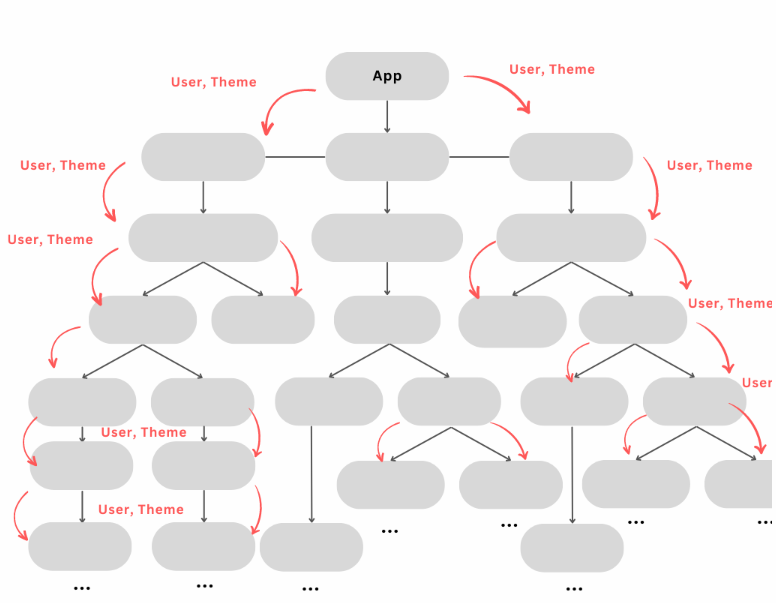
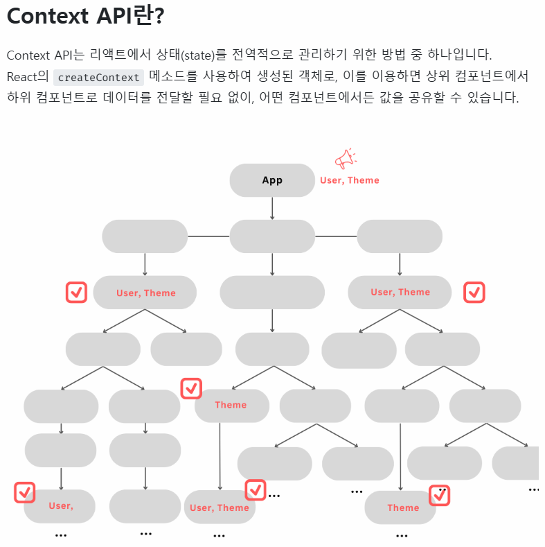

# React 06 — Context API (전역 상태 관리)

> 실습 코드: `my-app01/src/pages/step12-context`, `step13-context`

---

## 바로 확인하는 실행 결과

Footer의 `Mode` 버튼을 누르세요. Context에 공유한 테마 state를 구독하는 Header, Main, Footer가 함께 바뀝니다.

<div class="react-live-preview">
  <iframe class="react-live-frame" src="/REACT/demo/react-basics/#/lab/context" title="Context API 테마 실행 결과" loading="lazy"></iframe>
</div>

<p class="react-live-links"><a href="/REACT/demo/react-basics/#/lab/context" target="_blank" rel="noopener">↗ 새 탭에서 크게 보기</a></p>

## 1. 상태관리와 Props Drilling 문제

React 컴포넌트는 **트리(계층) 구조**이고, 데이터는 상위 → 하위로 **props**로 전달됩니다. 그런데 깊은 곳까지 전달하려면 중간 컴포넌트를 **모두 거쳐야** 합니다 — 이를 **Props Drilling**이라 합니다.



> 위 그림: `App`의 `User, Theme`를 깊은 자식까지 전하려고 중간 컴포넌트마다 props를 계속 넘김 → 코드 복잡·유지보수 어려움.

## 2. Context API

`createContext`로 만든 객체를 이용하면, 상위 → 하위로 일일이 전달할 필요 없이 **어떤 컴포넌트에서든 값을 공유**할 수 있습니다.



> 위 그림: 중간 전달 없이 **필요한 컴포넌트만** Context에서 값을 직접 꺼내 씀(체크 표시).

### 기본 사용법
```jsx
// 1) 생성
const ThemeContext = createContext();

// 2) 제공 (Provider로 감싸 value 전달)
<ThemeContext.Provider value={{ theme, setTheme }}>
  <Page />
</ThemeContext.Provider>

// 3) 소비 (어느 깊이의 자식이든)
const { theme } = useContext(ThemeContext);
```
실습에서는 `ThemeContext`, `UserContext` 두 개를 만들어 `Header/Main/Footer`에서 소비합니다(`step13-context`).

## 3. 상태관리 라이브러리 종류

Context 외에 전역 상태관리 라이브러리들도 있습니다:
**Redux (Redux Toolkit), Zustand, Recoil, Jotai**

> 본 과정에서는 가장 가볍고 직관적인 **Zustand**를 사용합니다. → [React 10 — Zustand](10-zustand-basics.md)

---
### 다음 단계
- [React 07 — useReducer](07-usereducer.md)
