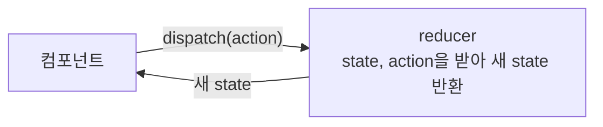

# React 07 — useReducer

> 실습 코드: [`step14-Reducer`](https://github.com/notetester/REACT/tree/main/code/react/01-basics-my-app01/src/pages/step14-Reducer)

---

## 바로 확인하는 실행 결과

금액을 입력하고 예금·출금을 눌러 보세요. 버튼의 `dispatch(action)`이 reducer를 거쳐 새 잔고 state를 만드는 흐름을 확인할 수 있습니다.

<div class="react-live-preview">
  <iframe class="react-live-frame react-live-frame--compact" src="/REACT/demo/react-basics/#/lab/reducer" title="useReducer 은행 실행 결과" loading="lazy"></iframe>
</div>

<p class="react-live-links"><a href="/REACT/demo/react-basics/#/lab/reducer" target="_blank" rel="noopener">↗ 새 탭에서 크게 보기</a></p>

## useReducer 란?

복잡한 상태관리를 더 **체계적이고 예측 가능하게** 처리하는 Hook. `useState`의 대체제로, 상태 변화 로직이 복합적일 때 더 명확합니다.

```jsx
const [state, dispatch] = useReducer(reducer, initialState);
```
| 요소 | 설명 |
|------|------|
| `state` | 현재 상태 |
| `dispatch` | 상태 변경을 **요청**하는 함수 |
| `reducer` | 상태를 **어떻게** 바꿀지 결정하는 함수 |
| `initialState` | 초기 상태값 |
| `action` | 변경 요청 객체 `{ type, payload }` (`type`=동작 이름, `payload`=데이터) |

## 동작 흐름



## 예제 (카운터)
```jsx
function reducer(state, action) {
  switch (action.type) {
    case 'INCREMENT': return { count: state.count + 1 };
    case 'DECREMENT': return { count: state.count - 1 };
    case 'SET':       return { count: action.payload };
    default:          return state;
  }
}

function Counter() {
  const [state, dispatch] = useReducer(reducer, { count: 0 });
  return (
    <>
      <span>{state.count}</span>
      <button onClick={() => dispatch({ type: 'INCREMENT' })}>+</button>
      <button onClick={() => dispatch({ type: 'DECREMENT' })}>-</button>
      <button onClick={() => dispatch({ type: 'SET', payload: 10 })}>10으로</button>
    </>
  );
}
```

> **useState vs useReducer**: 단순 상태는 `useState`, 여러 값이 함께 바뀌거나 변경 규칙이 복잡하면 `useReducer`가 깔끔합니다. (reducer의 `action` 패턴은 이후 Redux/Zustand 이해에도 도움)

---
### 다음 단계
- [React 08 — React Router](08-router.md)
