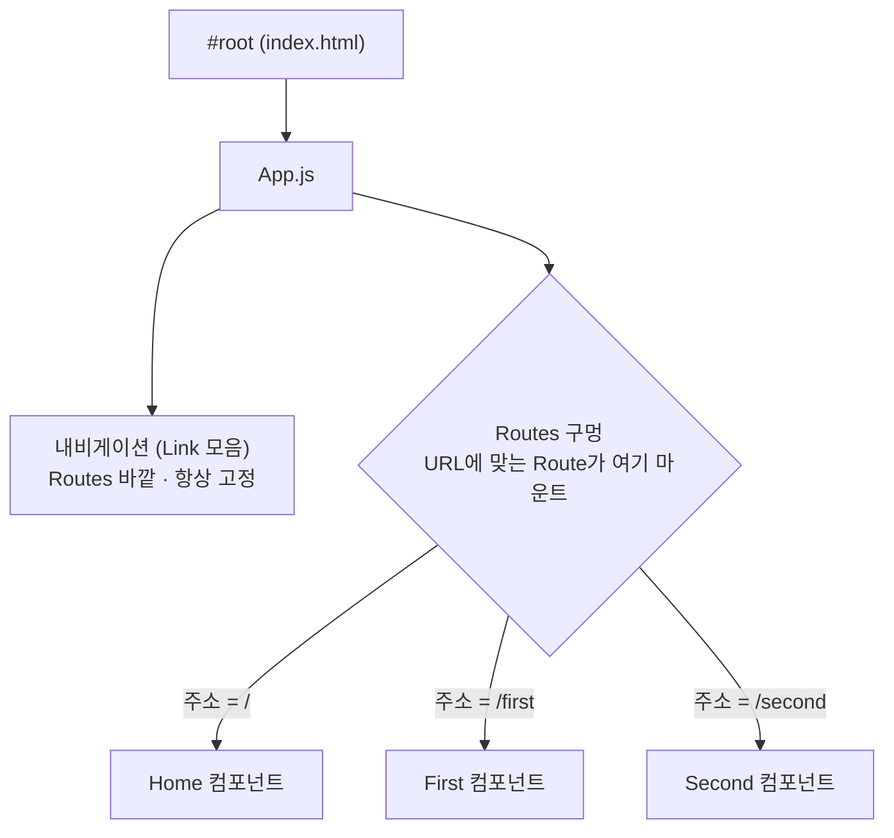

# React 08 — React Router (페이지 라우팅)

> 실습 코드: `my-app01/src/pages/step15-Router`, `step16-Router` · 버전: `react-router-dom` v6

---

> **3번 코드의 실제 동작**을 그 자리 바로 아래에 붙였습니다. 데모 안에서 링크를 누르면 새로고침 없이 화면만 바뀝니다. 단, **주소(URL) 변화는 iframe 안에서 보이지 않으니** "↗ 새 탭"으로 열어 브라우저 주소창과 함께 확인하세요.

## 1. 라우터란?

**URL(주소 경로)에 따라 어떤 컴포넌트를 화면에 보여줄지 결정**하는 역할. React Router는 **클라이언트 측 라우팅(CSR)**을 구현하는 표준 라이브러리로, 페이지 전체를 새로고침하지 않고 URL에 맞는 컴포넌트만 갈아끼웁니다.

설치: `npm install react-router-dom`

## 2. 핵심 컴포넌트

| 컴포넌트 | 역할 |
|----------|------|
| `BrowserRouter` | HTML5 History API로 주소를 관리하는 최상위 컴포넌트 |
| `Routes` | 여러 `Route`를 감싸고, 현재 URL과 가장 잘 맞는 경로를 선택 |
| `Route` | `path`(경로)와 `element`(보여줄 컴포넌트)를 연결 |
| `Link` | 새로고침 없이 주소를 바꾸는 `<a>`의 React 버전 |

## 3. 기본 사용 (step15)

라우팅의 진짜 핵심은 **"화면의 어디에 무엇이 끼워지는가"** 입니다. 앱 골격(→ [React 01 — 앱 골격](01-intro-setup.md#app-skeleton))의 `App.js`에서 화면을 두 부분으로 나눕니다 — **항상 보이는 내비게이션**과, **URL에 따라 컴포넌트가 갈아끼워지는 구멍 `<Routes>`**.



`<Link>`를 누르면 주소가 바뀌고, **그 주소에 맞는 `<Route>`의 컴포넌트만 `<Routes>` 자리에서 교체**됩니다. 내비게이션은 구멍 밖이라 그대로 남습니다 — 아래 코드에서 `<RouterTest02 />`(내비)가 `<Routes>` *앞에* 있는 이유입니다.

<div class="cr" markdown="1">
<div class="cr__code" markdown="1">

```jsx
// 네비게이션
import { Link } from 'react-router-dom';
<nav>
  <Link to="/">홈</Link>
  <Link to="/first">첫번째</Link>
  <Link to="/second">두번째</Link>
</nav>

// App.js — 라우트 정의
<BrowserRouter>
  <RouterTest02 />
  <Routes>
    <Route path="/" element={<Home />} />
    <Route path="/first" element={<First msg='환영합니다.' />} />
    <Route path="/second" element={<Second data={data} />} />
    {/* URL 파라미터 패턴 :idx, :name 은 변수 자리 */}
    <Route path="/third/:idx/:name" element={<Third data={data} />} />
  </Routes>
</BrowserRouter>
```

</div>
<div class="cr__view">
<p class="cr__label">▶ 결과 — 위 메뉴는 고정(Routes 밖), 아래 영역이 Routes 구멍 — 링크를 누르면 그 부분만 교체됩니다</p>
<iframe class="cr__frame cr__frame--app" src="/REACT/demo/react-basics/" loading="lazy" title="React Router 실행 결과"></iframe>
</div>
</div>

<p class="react-live-links"><a href="/REACT/demo/react-basics/" target="_blank" rel="noopener">↗ 새 탭에서 주소(URL) 변화까지 보기</a> — 같은 화면이지만 주소창의 경로가 바뀌는 것을 확인할 수 있습니다.</p>

## 4. URL 파라미터 (step16)

`:idx`, `:name` 처럼 콜론으로 시작하는 부분은 **변수 자리**입니다. 자식에서 `useParams`로 읽습니다.
```jsx
import { useParams } from 'react-router-dom';
const { idx, name } = useParams();
```
- `useNavigate()` — 코드로 페이지 이동: `const navigate = useNavigate(); navigate('/')`

> 이 패턴은 이후 **Axios 상세보기**(`/axios02/:id`)와 **연동 프로젝트**의 페이지 보호(`PrivateRoute`)로 이어집니다. → [React 09](09-fetch-axios.md), [연동 흐름](../integration/react-springboot-jwt-flow.md)

!!! note "GitHub Pages 데모"
    로컬 개발에서는 `BrowserRouter`, 정적 GitHub Pages 빌드에서는 `HashRouter`를 사용합니다. 정적 서버에서 `/todo` 같은 경로를 직접 새로고침할 때 발생하는 404를 피하기 위한 선택입니다.

---
### 다음 단계
- [React 09 — Fetch / Axios](09-fetch-axios.md)
