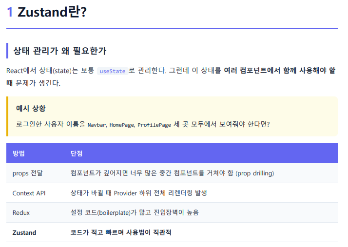
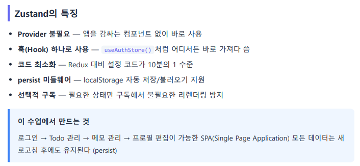
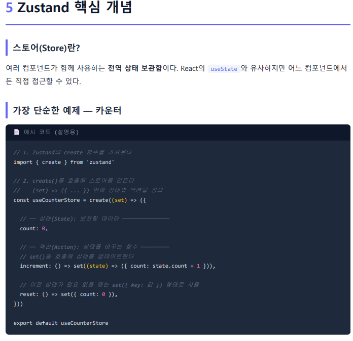
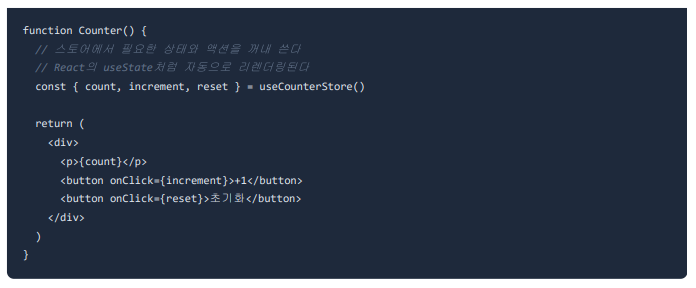
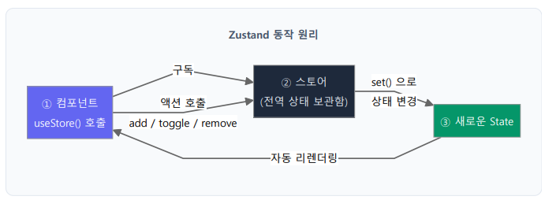
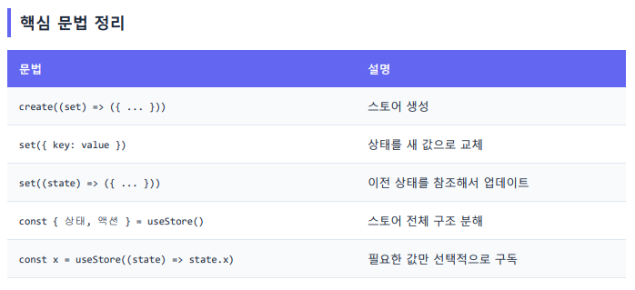
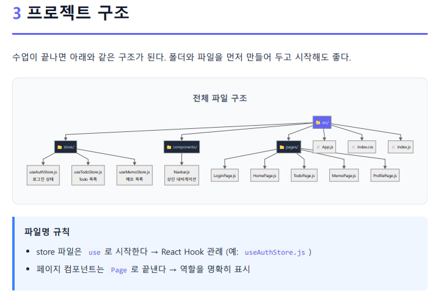
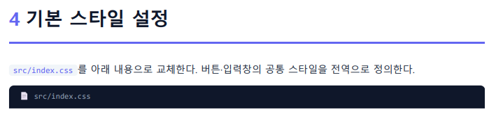
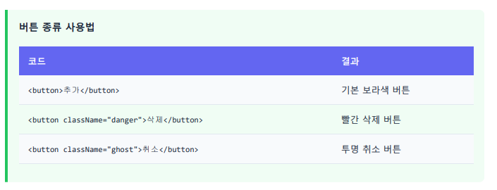
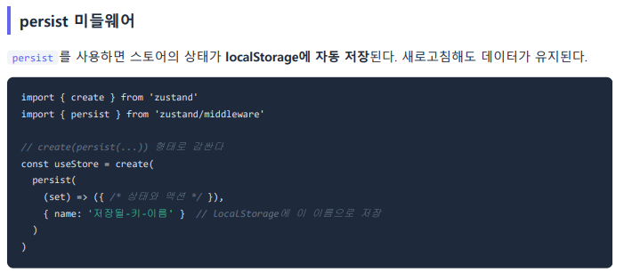

# React 10 — Zustand 기초 (전역 상태관리)

> 실습 코드: [`code/react/02-zustand-my-app02`](https://github.com/notetester/REACT/tree/main/code/react/02-zustand-my-app02)

---

## 1. Zustand 란? — 왜 필요한가

여러 컴포넌트가 같은 상태를 함께 써야 할 때(예: 로그인 사용자 이름을 `Navbar`·`HomePage`·`ProfilePage`에서 모두 표시) 상태관리가 필요합니다.



| 방법 | 단점 |
|------|------|
| props 전달 | 깊어지면 너무 많은 중간 컴포넌트를 거침(prop drilling) |
| Context API | 상태가 바뀌면 Provider 하위 전체 리렌더링 |
| Redux | 설정 코드(boilerplate)가 많고 진입장벽 높음 |
| **Zustand** | **코드가 적고 빠르며 사용법이 직관적** |

## 2. Zustand의 특징



- **Provider 불필요** — 앱을 감싸는 컴포넌트 없이 바로 사용
- **훅(Hook) 하나로 사용** — `useAuthStore()`처럼 어디서든
- **코드 최소화** — Redux 대비 1/10 수준
- **persist 미들웨어** — localStorage 자동 저장/불러오기
- **선택적 구독** — 필요한 상태만 구독해 불필요한 리렌더 방지

> 이 수업에서 만드는 것: **로그인 → Todo → 메모 → 프로필 편집**이 가능한 SPA. 모든 데이터는 새로고침 후에도 유지(persist).

## 3. 핵심 개념 — 스토어(Store)

스토어 = 여러 컴포넌트가 함께 쓰는 **전역 상태 보관함**. `useState`와 비슷하지만 어디서든 직접 접근 가능.



```jsx
import { create } from 'zustand'
const useCounterStore = create((set) => ({
  count: 0,                                                    // 상태(State)
  increment: () => set((state) => ({ count: state.count + 1 })), // 액션: 이전 상태 참조
  reset: () => set({ count: 0 }),                              // 이전 상태 불필요 → set({key:값})
}))
```
```jsx
// 컴포넌트에서 — useState처럼 자동 리렌더링
const { count, increment, reset } = useCounterStore()
```


### 동작 원리


① 컴포넌트가 `useStore()`로 구독/액션 호출 → ② 스토어가 `set()`으로 상태 변경 → ③ 새로운 State → **자동 리렌더링**으로 ①에 반영(순환)

### 문법 정리


| 문법 | 설명 |
|------|------|
| `create((set) => ({ ... }))` | 스토어 생성 |
| `set({ key: value })` | 상태를 새 값으로 교체 |
| `set((state) => ({ ... }))` | 이전 상태 참조해 업데이트 |
| `const { 상태, 액션 } = useStore()` | 전체 구조분해 |
| `const x = useStore((s) => s.x)` | **필요한 값만 선택 구독** |

## 4. 프로젝트 구조 & 기본 스타일



- `store/` 파일은 `use`로 시작 (예: `useAuthStore.js`) → Hook임을 표시
- 페이지 컴포넌트는 `Page`로 끝냄 → 역할 명시

기본 스타일은 `src/index.css`(또는 `App.css`)에 버튼/입력창 공통 스타일을 전역 정의합니다.




| 클래스 | 결과 |
|--------|------|
| `<button>` | 기본 보라색 버튼 |
| `<button className="danger">` | 빨간 삭제 버튼 |
| `<button className="ghost">` | 투명 취소 버튼 |

## 5. persist 미들웨어 — localStorage 자동 저장



```jsx
import { create } from 'zustand'
import { persist } from 'zustand/middleware'
const useStore = create(
  persist(
    (set) => ({ /* 상태와 액션 */ }),
    { name: '저장될-키-이름' }   // localStorage 키
  )
)
```
> `my-app02`에서는 `useTodoStore`(`todo-storage`), `useMemoStore`(`memo-storage`)가 persist로 새로고침 후에도 유지됩니다.

---
### 다음 단계
- [React 11 — Zustand 인증·CRUD 응용](11-zustand-auth-crud.md)
