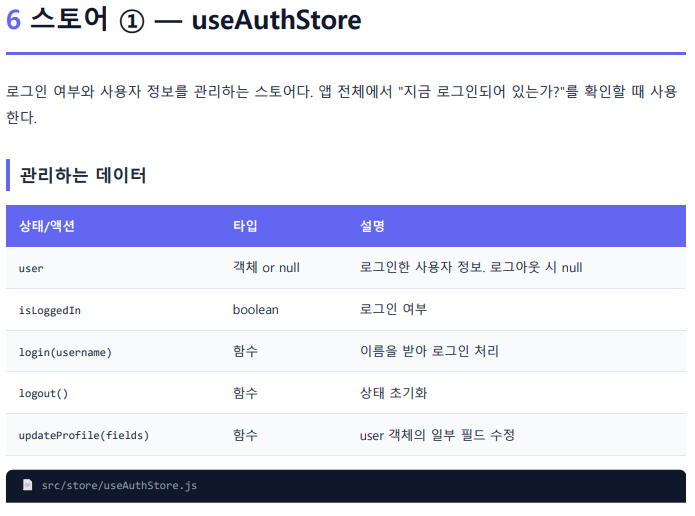
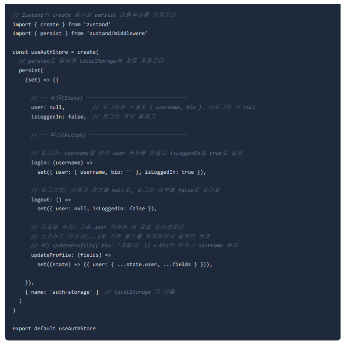
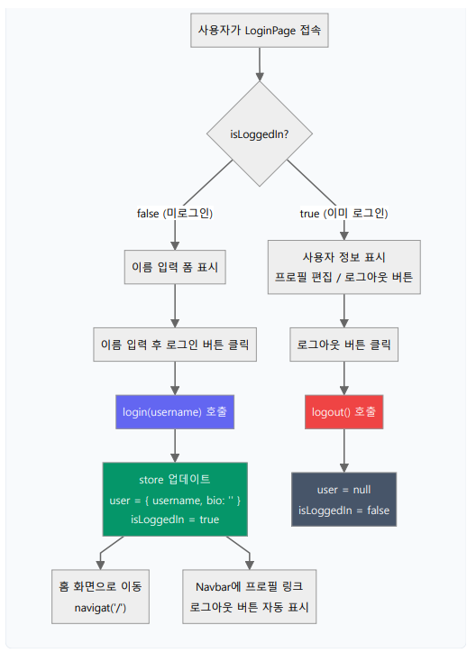
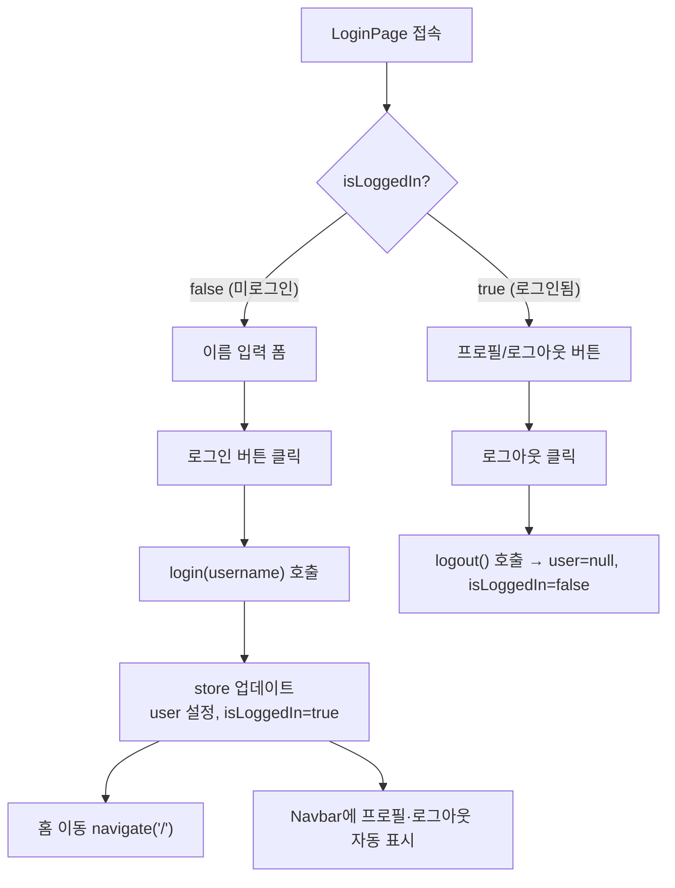

# React 11 — Zustand 응용: 인증 · 로그인 흐름 · CRUD

> 실습 코드: [`code/react/02-zustand-my-app02`](https://github.com/notetester/REACT/tree/main/code/react/02-zustand-my-app02)
> (이 단원의 강사 필기는 이미지로 작성되어 있어, 원본 캡처를 함께 싣습니다.)

---

> 이 단원의 앱을 **2번 로그인 흐름 코드 바로 아래**에서 직접 조작할 수 있습니다. 하나의 `useAuthStore` 변화가 Navbar와 여러 화면에 동시에 반영되는 것을 눈으로 확인하세요.

## 1. `useAuthStore` — 로그인 상태 스토어

앱 전체에서 "지금 로그인되어 있는가?"를 확인하는 스토어.



| 상태/액션 | 타입 | 설명 |
|-----------|------|------|
| `user` | 객체 \| null | 로그인 사용자 정보. 로그아웃 시 null |
| `isLoggedIn` | boolean | 로그인 여부 |
| `login(username)` | 함수 | 로그인 처리 |
| `logout()` | 함수 | 상태 초기화 |
| `updateProfile(fields)` | 함수 | user 일부 필드 수정 |



```jsx
import { create } from 'zustand'
import { persist } from 'zustand/middleware'
const useAuthStore = create(persist(
  (set) => ({
    user: null,
    isLoggedIn: false,
    login: (username) => set({ user: { username, bio: '' }, isLoggedIn: true }),
    logout: () => set({ user: null, isLoggedIn: false }),
    // 스프레드(...)로 기존 필드 유지하면서 일부만 변경
    updateProfile: (fields) => set((state) => ({ user: { ...state.user, ...fields } })),
  }),
  { name: 'auth-storage' }
))
```

## 2. 로그인 / 로그아웃 흐름





### Navbar — 조건부 렌더링 + NavLink
```jsx
const { isLoggedIn, logout } = useAuthStore();
const cls = ({ isActive }) => isActive ? 'active' : '';   // NavLink가 현재경로면 isActive=true
<NavLink to="/" className={cls}>홈</NavLink>
{isLoggedIn && <NavLink to="/profile" className={cls}>프로필</NavLink>}   {/* 로그인 시에만 */}
{isLoggedIn && <button className="danger" onClick={logout}>로그아웃</button>}
```

### LoginPage
<div class="cr" markdown="1">
<div class="cr__code" markdown="1">

```jsx
const { login } = useAuthStore();
const navigate = useNavigate();
const handleLogin = () => { if (!input.trim()) return; login(input); navigate('/'); };
<input value={input} onChange={(e) => setInput(e.target.value)}
       onKeyDown={(e) => e.key === 'Enter' && handleLogin()} />
<button onClick={handleLogin}>로그인</button>   {/* 함수 "참조" — 클릭 시 실행 */}
```

</div>
<div class="cr__view">
<p class="cr__label">▶ 결과 — 이름 입력 후 로그인 → Navbar에 프로필·로그아웃 등장(같은 store가 여러 화면에 반영). Todo·메모도 추가해 보세요</p>
<iframe class="cr__frame cr__frame--app" src="/REACT/demo/zustand/#/login" loading="lazy" title="Zustand 로그인 CRUD 실행 결과"></iframe>
<p class="cr__mount">📍 이 앱 = <code>my-app02</code> · <code>index.js</code> → <code>&lt;App /&gt;</code> → <code>App.js</code> 라우트. 로그인 폼=<code>LoginPage</code>, 상단 바=<code>Navbar</code></p>
</div>
</div>

<p class="react-live-links"><a href="/REACT/demo/zustand/#/login" target="_blank" rel="noopener">↗ 새 탭에서 크게 보기</a></p>

??? note "👉 직접 따라 하기 — 로그인·CRUD 앱(my-app02) 실행"
    이 화면은 **`my-app02`**의 로그인 화면(`/login`)입니다.

    **① 설치·실행** — `code/react/02-zustand-my-app02`에서 `npm install` → `npm start` → `http://localhost:3000`

    **② 핵심 파일** (모두 `my-app02/src` 아래) — `LoginPage`(로그인 폼), `Navbar`(상단 바), `store/useAuthStore`(로그인 상태).

    **③ 동작** — 이름을 입력해 로그인하면 `useAuthStore`가 바뀌고, 그 한 번의 변화가 Navbar와 여러 화면에 동시에 반영됩니다. Todo·메모도 추가해 보세요.

## 3. CRUD 스토어 — Todo / Memo (persist)

`useTodoStore`, `useMemoStore`는 목록 데이터를 persist로 관리합니다. 전형적인 패턴:
```jsx
const useTodoStore = create(persist((set) => ({
  todos: [],
  addTodo:    (text) => set((s) => ({ todos: [...s.todos, { id: Date.now(), text, done: false }] })),
  toggleTodo: (id)   => set((s) => ({ todos: s.todos.map(t => t.id === id ? { ...t, done: !t.done } : t) })),
  removeTodo: (id)   => set((s) => ({ todos: s.todos.filter(t => t.id !== id) })),
}), { name: 'todo-storage' }))
```
> 불변성 유지가 핵심: 추가는 `[...배열, 새값]`, 수정은 `map`, 삭제는 `filter`.

## 4. 다음 단계 — 실제 백엔드 연동

여기까지는 **프론트 단독**(localStorage)입니다. 다음 단계에서는 동일한 Zustand 패턴 위에 **Axios + JWT**를 얹어 Spring Boot 서버와 실제로 연동합니다.

→ **[★ React ↔ Spring Boot JWT 연동 흐름](../integration/react-springboot-jwt-flow.md)** ([`my-app03`](https://github.com/notetester/REACT/tree/main/code/react/03-integration-my-app03) ↔ [`MyProject02`](https://github.com/notetester/REACT/tree/main/code/springboot/02-integration-MyProject02))
