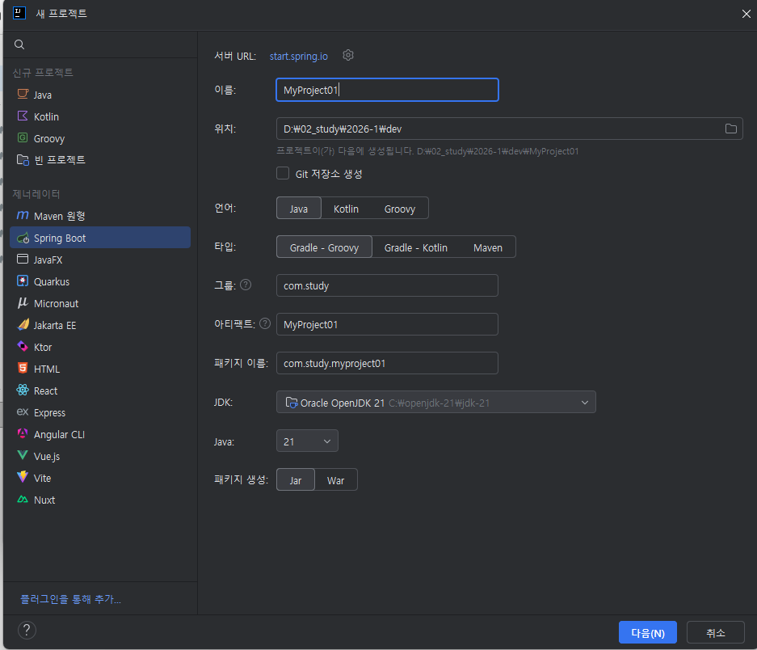
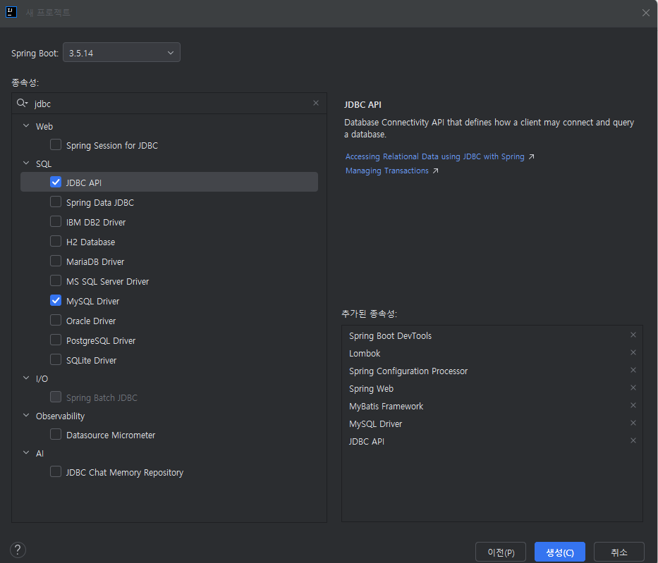
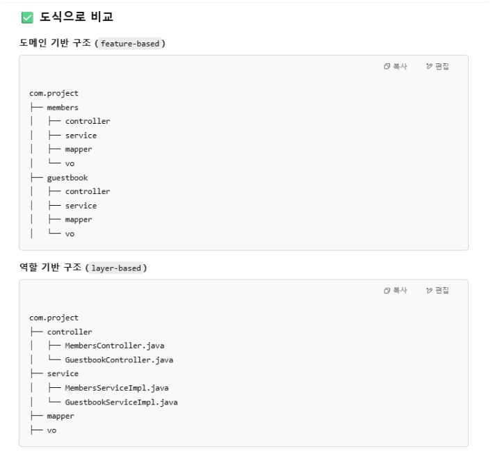
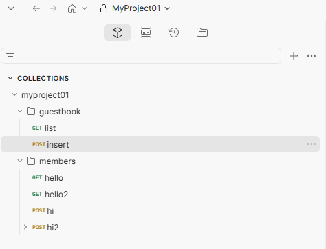
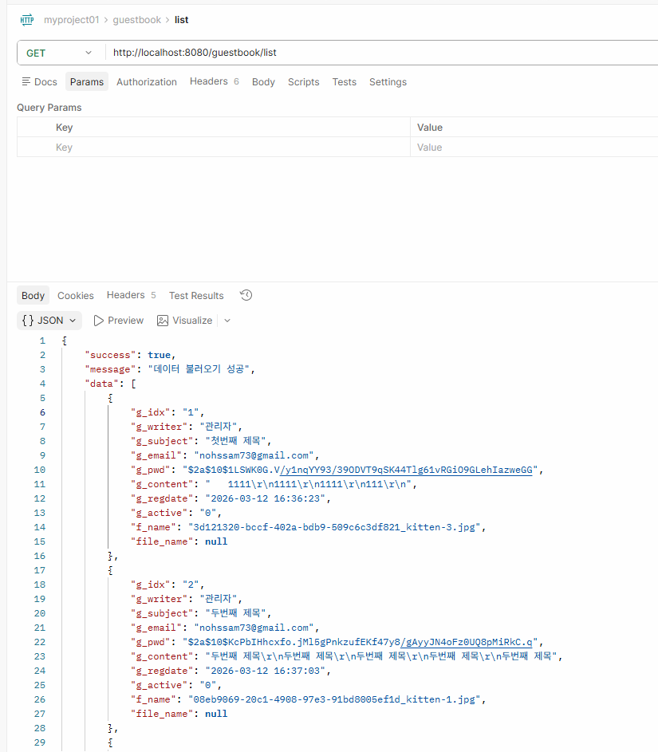

# Spring Boot 01 — 프로젝트 구조와 레이어드 아키텍처

> 실습 코드: [`code/springboot/01-jwt-MyProject01`](https://github.com/notetester/REACT/tree/main/code/springboot/01-jwt-MyProject01)
> 강사 필기(Notion) 원문 + 캡처 이미지를 코드 기준으로 정리/보강했습니다.

---

## 1. 빌드 도구 — Maven vs Gradle

**빌드 자동화 도구**는 개발자가 작성한 소스코드를 **컴파일 → 테스트 → 패키징**하여 실행 가능한 애플리케이션을 만드는 과정을 자동화합니다.

| 구분 | 중간 프로젝트 | 최종 프로젝트 |
|------|--------------|--------------|
| 애플리케이션 구성 | 전통적 Spring MVC 설정 | **Spring Boot 자동 설정** |
| 빌드 도구 | **Maven** (`pom.xml`) | **Gradle** (`build.gradle`) |
| 화면 | JSP | **React** |
| 톰캣 | 외부 톰캣 | 내부 톰캣(내장) |
| 패키징 | `war` | `jar` |
| 특징 | 외부 서버·설정 파일을 직접 다루는 경우가 많음 | 내장 서버와 자동 설정으로 빠르게 시작 |
| 자바 | Java 21 | Java 21 |

→ 최종 프로젝트는 **Spring Boot + Gradle + React** 조합입니다.

!!! note "Spring MVC와 Spring Boot는 서로 반대말이 아닙니다"
    Spring MVC는 Servlet 기반 웹 프레임워크이고, Spring Boot는 설정과 실행을 단순화하는 도구입니다. 이 교재의 Spring Boot 앱도 내부적으로 Spring MVC를 사용합니다. 강의의 표는 프로젝트 구성 방식과 배포 경험의 차이를 비교한 것입니다.

## 2. 프로젝트 생성 (IntelliJ + start.spring.io)

IntelliJ `새 프로젝트 → Spring Boot`. 이름 `MyProject01`, 타입 `Gradle - Groovy`, 그룹 `com.study`, 패키지 `com.study.myproject01`, JDK **21**, 패키징 **Jar**.



의존성 선택: Spring Web, Spring Boot DevTools, Lombok, Spring Configuration Processor, **MyBatis Framework**, **MySQL Driver**, JDBC API.



> 본 실습의 최종 `build.gradle`은 Spring Boot `4.0.6`으로 정리되어 있습니다. 공식 [System Requirements](https://docs.spring.io/spring-boot/system-requirements.html)에 따르면 `4.0.6`은 Java 17 이상을 요구하고 Java 26까지 호환됩니다. 이 교재는 Java 21로 통일합니다.

### Gradle 파일 역할
| 파일 | 역할 |
|------|------|
| `build.gradle` | 프로젝트의 "레시피" — 라이브러리·플러그인 선언 |
| `settings.gradle` | 프로젝트 "이름표" — 이름·멀티모듈 등록 |
| `gradle/wrapper/` | Gradle 버전을 팀원 모두 동일하게 맞추는 장치(직접 설치 불필요) |
| `gradlew` | `./gradlew build` 로 실행하는 스크립트 |
| `src/` | 실제 Java 코드 (Maven과 동일 구조) |
| `build/` | Gradle 자동 생성 폴더 → `.gitignore` |

### build.gradle (실제)
```gradle
plugins {
    id 'java'
    id 'org.springframework.boot' version '4.0.6'
    id 'io.spring.dependency-management' version '1.1.7'
}
java { toolchain { languageVersion = JavaLanguageVersion.of(21) } }

dependencies {
    implementation 'org.springframework.boot:spring-boot-starter-jdbc'
    implementation 'org.springframework.boot:spring-boot-starter-webmvc'
    implementation 'org.mybatis.spring.boot:mybatis-spring-boot-starter:4.0.1'
    compileOnly 'org.projectlombok:lombok'
    developmentOnly 'org.springframework.boot:spring-boot-devtools'
    runtimeOnly 'com.mysql:mysql-connector-j'           // MyProject01 = MySQL
    annotationProcessor 'org.springframework.boot:spring-boot-configuration-processor'
    annotationProcessor 'org.projectlombok:lombok'
    // (Day02에서 추가) security + jwt
    implementation 'org.springframework.boot:spring-boot-starter-security'
    implementation 'io.jsonwebtoken:jjwt-api:0.11.5'
    implementation 'io.jsonwebtoken:jjwt-impl:0.11.5'
    implementation 'io.jsonwebtoken:jjwt-jackson:0.11.5'
}
```

### application.yaml (MyProject01 = MySQL)
```yaml
spring:
  application:
    name: MyProject01
  datasource:
    driver-class-name: com.mysql.cj.jdbc.Driver
    url: ${DB_URL:jdbc:mysql://localhost:3306/dbstudy?useSSL=false&serverTimezone=Asia/Seoul&allowPublicKeyRetrieval=true}
    username: ${DB_USERNAME:dbuser}
    password: ${DB_PASSWORD:1234}  # localhost 학습 기본값, 환경변수로 덮어쓰기
mybatis:
  mapper-locations: classpath:mapper/*.xml
  type-aliases-package: com.study.myproject01.*.vo
```

## 3. 패키지 구조 — 도메인 기반(feature-based)

이 프로젝트는 **도메인(기능) 기반** 구조를 사용합니다. (역할 기반과 비교)



```
com.study.myproject01
├── common
│   ├── jwt   (JwtConfig, JwtUtil, JwtRequestFilter)
│   └── vo    (DataVO)
├── config    (AppConfig, SecurityConfig)
├── guestbook
│   ├── controller / service / mapper / vo
├── members
│   ├── controller / service / mapper / vo
└── MyProject01Application
```

## 4. 공통 응답 래퍼 — `DataVO` (★ 핵심 패턴)

모든 REST 응답을 `{success, message, data}` 형태로 통일합니다.

```java
@Data @AllArgsConstructor @NoArgsConstructor
public class DataVO {
    private boolean success;   // 성공 여부
    private String  message;   // 메시지
    private Object  data;      // 실제 데이터(any)
}
```

## 5. 레이어드 아키텍처 (Controller → Service → ServiceImpl → Mapper → XML)

```
요청 → Controller(@RestController) → Service(interface)
     → ServiceImpl(@Service) → Mapper(@Mapper interface) → mapper.xml(SQL) → DB
```

- **MembersController** — REST 4가지 요청 패턴 학습용 엔드포인트
  - `GET /members/hello` → 문자열
  - `GET /members/hello2?msg=...` → `@RequestParam`
  - `POST /members/hi2` (JSON 바디) → `@RequestBody Map`
- **GuestBookController** — `list`(GET) / `insert`(POST) / `detail`(POST), 모두 `DataVO`로 감싸 try-catch 처리
- **GuestBookMapper**(`@Mapper`) ↔ `resources/mapper/guestbook-mapper.xml`
  ```xml
  <select id="guestBookList" resultType="GuestBookVO">
    select g_idx, g_writer, g_subject, g_email, g_content, g_regdate, g_active, f_name
    from guestbook where g_active = 0
  </select>
  <insert id="guestBookInsert" parameterType="GuestBookVO">
    insert into guestbook(g_writer, g_subject, g_content, g_email, g_pwd, g_regdate)
    values(#{g_writer}, #{g_subject}, #{g_content}, #{g_email}, #{g_pwd}, now())
  </insert>
  ```

## 6. 요청 → 응답으로 확인하기 (Postman/curl)

§5의 레이어를 지나면 요청이 어떤 응답이 되는지, `MembersController`의 **세 가지 요청 패턴**과 GuestBook 목록으로 확인합니다. 모든 REST 응답은 `DataVO`의 `{success, message, data}` 형태로 통일됩니다.

!!! info "① 경로만 — `GET /members/hello`"
    파라미터 없이 문자열을 반환하는 가장 단순한 형태입니다.

    ```http
    GET /members/hello HTTP/1.1
    Host: localhost:8080
    ```
    ```http
    HTTP/1.1 200 OK
    Content-Type: text/plain
    hello
    ```

!!! info "② 쿼리스트링 — `@RequestParam` · `GET /members/hello2?msg=hi`"
    `?msg=hi`의 값이 메서드 인자로 바인딩됩니다.

    ```http
    GET /members/hello2?msg=hi HTTP/1.1
    Host: localhost:8080
    ```
    ```java
    @GetMapping("/hello2")
    public String hello2(@RequestParam String msg) { return "msg = " + msg; }
    ```
    ```http
    HTTP/1.1 200 OK
    Content-Type: text/plain
    msg = hi
    ```

!!! info "③ JSON 바디 — `@RequestBody` · `POST /members/hi2`"
    JSON 본문이 `Map`(또는 VO)으로 변환되어 들어옵니다.

    ```http
    POST /members/hi2 HTTP/1.1
    Host: localhost:8080
    Content-Type: application/json
    { "name": "study", "age": 20 }
    ```
    ```java
    @PostMapping("/hi2")
    public String hi2(@RequestBody Map<String,Object> body) { return "name = " + body.get("name"); }
    ```
    ```http
    HTTP/1.1 200 OK
    Content-Type: text/plain
    name = study
    ```

!!! success "④ DataVO로 감싼 목록 — `GET /guestbook/list`"
    §5의 MyBatis `guestBookList` SQL이 조회한 행이 그대로 `DataVO.data` 배열이 됩니다. **공개 목록이라 비밀번호(`g_pwd`)는 응답에서 제외**됩니다.

    ```http
    GET /guestbook/list HTTP/1.1
    Host: localhost:8080
    ```
    ```http
    HTTP/1.1 200 OK
    Content-Type: application/json
    { "success": true, "message": "데이터 불러오기 성공",
      "data": [
        { "g_idx": 1, "g_writer": "study", "g_subject": "첫 글", "g_content": "방가", "g_regdate": "2026-01-02" }
      ] }
    ```
    SQL이 고른 컬럼(`g_idx, g_writer, g_subject, …`)이 곧 `data` 안 객체의 필드가 됩니다.

> 아래는 실제 Postman 컬렉션과 목록 응답 화면입니다.




---

### 다음 단계
- [Spring Boot 02 — Spring Security](02-spring-security.md)
- [Spring Boot 03 — JWT](03-jwt.md)
- [Spring Boot 04 — REST API 품질](04-rest-api-quality.md)
