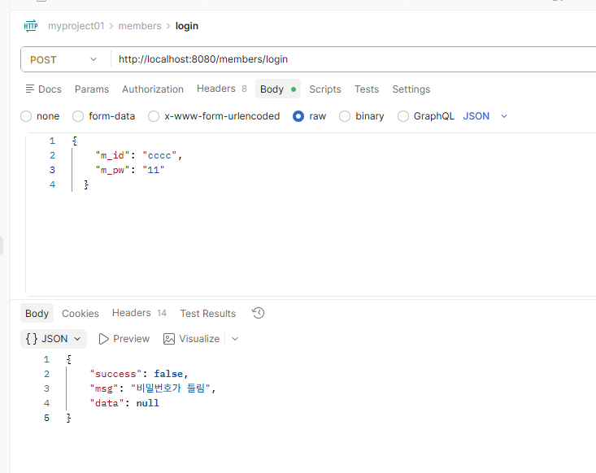
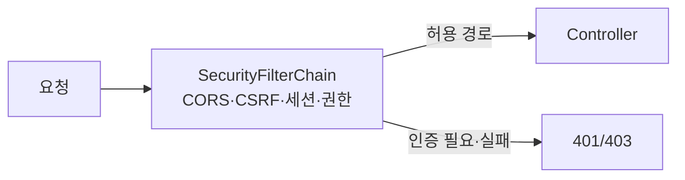

# Spring Boot 02 — Spring Security

> 실습 코드: [`code/springboot/01-jwt-MyProject01`](https://github.com/notetester/REACT/tree/main/code/springboot/01-jwt-MyProject01)
> 참조: <https://docs.spring.io/spring-security/reference/servlet/configuration/java.html>

---

## 1. 인증(Authentication) vs 인가(Authorization)

Spring Security는 애플리케이션 **보안을 강화**하는 프레임워크입니다. 두 축으로 나뉩니다.

### Authentication (인증) — "당신이 누구인가" 신원 확인
| 구성요소 | 역할 |
|---|---|
| `AuthenticationManager` | 인증 처리 핵심 인터페이스 |
| `UserDetailsService` | 사용자 정보를 로드 |
| `PasswordEncoder` | 비밀번호 암호화/검증 |
| `SecurityContextHolder` | 인증된 사용자 정보를 전역 저장·관리 |

### Authorization (인가) — "그것을 할 권한이 있는가" 접근 확인
| 구성요소 | 역할 |
|---|---|
| `SecurityFilterChain` | HTTP 요청 보안 규칙을 정의하는 필터 체인 |
| `GrantedAuthority` | 사용자의 권한 정보 |
| `AccessDecisionManager` | 접근 권한 결정 |

## 2. Spring Security 필터 체인

필터는 **순서대로** 실행되며, 먼저 실행된 필터가 다음 필터에 영향을 줍니다.


강의 캡처의 목록은 필터 개념을 익히는 데 유용합니다. 다만 실제 필터 목록은 Spring Security 버전과 활성화한 기능에 따라 달라집니다. 현재 공식 [Servlet Architecture](https://docs.spring.io/spring-security/reference/servlet/architecture.html) 예시에서는 `SecurityContextHolderFilter`, `CsrfFilter`, `ExceptionTranslationFilter`, `AuthorizationFilter` 등을 확인할 수 있습니다.

| 개념 | 역할 |
|---|---|
| `SecurityContextHolderFilter` | 현재 요청의 인증 컨텍스트 준비 |
| `CsrfFilter` | unsafe HTTP 요청의 CSRF 토큰 검사. 기본 활성 |
| `ExceptionTranslationFilter` | 인증·인가 예외를 HTTP 응답으로 변환 |
| `AuthorizationFilter` | 요청 URL에 필요한 권한 검사 |
| 프로젝트의 `JwtRequestFilter` | Bearer JWT를 직접 읽고 인증 객체 등록 |

> 본 프로젝트는 OAuth2 Resource Server 구성을 사용하지 않고 직접 만든 `JwtRequestFilter`를 `UsernamePasswordAuthenticationFilter` **앞에** 삽입합니다. 특정 기능을 켜지 않았다면 공식 문서에 등장하는 모든 필터가 무조건 실행되는 것은 아닙니다. → [JWT 편](03-jwt.md)

## 3. 프로젝트 구조


`config/` 아래에 `AppConfig`(PasswordEncoder)와 `SecurityConfig`(필터체인)를 둡니다.

## 4. 의존성 추가

```gradle
// build.gradle
implementation 'org.springframework.boot:spring-boot-starter-security'
```

## 5. `SecurityConfig` — 보안 규칙 정의

```java
@Slf4j @Configuration @EnableWebSecurity   // 부팅 시 실행 + 웹 보안 활성화
public class SecurityConfig {
    @Bean
    SecurityFilterChain securityFilterChain(HttpSecurity http,
                                            CorsConfigurationSource corsConfigurationSource) throws Exception {
        http
          // ① CORS — 출처가 다른 서버 간 리소스 공유 허용 (React:3000 ↔ Spring:8080)
          .cors(cors -> cors.configurationSource(corsConfigurationSource()))
          // ② Authorization 헤더 JWT 실습 구조이므로 CSRF 보호 비활성
          .csrf(csrf -> csrf.disable())
          // ③ 세션 STATELESS — 세션을 만들지 않음(JWT 권장)
          .sessionManagement(s -> s.sessionCreationPolicy(SessionCreationPolicy.STATELESS))
          // ④ 요청별 권한
          .authorizeHttpRequests(auth -> auth
              .requestMatchers("/members/login", "/members/register", "/members/refresh").permitAll()
              .requestMatchers("/guestbook/**").permitAll()
              .anyRequest().authenticated());
        return http.build();
    }

    @Bean
    CorsConfigurationSource corsConfigurationSource() {
        CorsConfiguration c = new CorsConfiguration();
        c.setAllowedOrigins(Arrays.asList("http://localhost:3000"));   // 리액트
        c.setAllowedMethods(Arrays.asList("GET","POST","PUT","DELETE","OPTIONS"));
        c.setAllowedHeaders(Arrays.asList("*"));
        c.setAllowCredentials(true);
        UrlBasedCorsConfigurationSource src = new UrlBasedCorsConfigurationSource();
        src.registerCorsConfiguration("/**", c);
        return src;
    }
}
```

> 💡 **CORS**: 서로 다른 출처(origin) 간 요청을 차단하는 브라우저 정책. React(3000)와 Spring(8080)은 포트가 다르므로 출처가 다릅니다 → 서버에서 명시적으로 허용해야 합니다.
> 💡 **CSRF**: 로그인된 상태를 악용해 악성 사이트가 사용자 권한으로 요청을 보내는 공격. 이 실습은 브라우저가 자동 전송하지 않는 Authorization 헤더에 JWT를 넣으므로 CSRF 보호를 비활성화합니다. JWT를 쿠키에 저장해 자동 전송한다면 별도 CSRF 방어가 필요합니다.

Spring Security 공식 [CORS](https://docs.spring.io/spring-security/reference/servlet/integrations/cors.html) 문서는 CORS가 Security보다 먼저 처리되어야 한다고 설명합니다. 브라우저의 preflight 요청에는 인증 쿠키가 없을 수 있기 때문입니다. 이 프로젝트는 `CorsConfigurationSource`를 Security DSL에 연결합니다.

Spring Security 공식 [CSRF](https://docs.spring.io/spring-security/reference/servlet/exploits/csrf.html) 문서는 로그인 가능한 브라우저 애플리케이션에서 CSRF 방어를 검토해야 한다고 설명합니다. 핵심은 “JWT인가?”가 아니라 **브라우저가 인증 정보를 자동으로 전송하는가?**입니다.

## 6. 요청 → 응답으로 확인하는 보안 규칙 (Postman/curl)

`SecurityConfig`의 규칙이 실제 요청에 어떻게 반영되는지, **같은 엔드포인트를 토큰 유무·유효성만 바꿔** 호출한 결과입니다. (요청 = Postman/`curl`, 아래 JSON = 응답 본문) — 실제 자동 실행 기록은 [Actions API 스냅샷](../generated/integration-snapshot.md) 참고.

!!! success "① permitAll — 토큰 없이도 통과 · `GET /guestbook/list`"
    ```text
    GET /guestbook/list                 (Authorization 헤더 없음)
    ```
    ```json
    200 OK
    { "success": true, "message": "데이터 불러오기 성공", "data": [ /* 목록 */ ] }
    ```
    규칙: `requestMatchers(HttpMethod.GET, "/guestbook/list").permitAll()` → 인증 없이 허용.

!!! failure "② 보호 자원 — 토큰 없음 · `GET /members/myPage`"
    ```text
    GET /members/myPage                 (Authorization 헤더 없음)
    ```
    ```json
    401 Unauthorized
    { "success": false, "message": "인증이 필요합니다." }
    ```
    규칙: `anyRequest().authenticated()` + `exceptionHandling`의 `authenticationEntryPoint` → 인증 없으면 401 JSON.

!!! success "③ 보호 자원 — 유효한 토큰 · `GET /members/myPage`"
    ```text
    GET /members/myPage
    Authorization: Bearer <accessToken>
    ```
    ```json
    200 OK
    { "success": true, "message": "마이페이지 성공", "data": { "m_id": "study", "m_name": "..." } }
    ```
    흐름: `JwtRequestFilter`가 토큰 검증 → `SecurityContextHolder`에 등록 → 컨트롤러가 `getPrincipal()`로 userId 사용.

!!! warning "④ 보호 자원 — 만료된 토큰 · `GET /members/myPage`"
    ```text
    GET /members/myPage
    Authorization: Bearer <expired token>
    ```
    ```json
    401 Unauthorized
    { "success": false, "message": "token expired" }
    ```
    `JwtRequestFilter`의 `ExpiredJwtException` 분기 → 클라이언트는 `POST /members/refresh`로 재발급 시도. → [JWT 편](03-jwt.md), [연동 흐름](../integration/react-springboot-jwt-flow.md)

!!! warning "⑤ 로그인 — 비밀번호 불일치 · `POST /members/login`"
    ```text
    POST /members/login
    Content-Type: application/json
    { "m_id": "study", "m_pw": "wrong" }
    ```
    ```json
    200 OK
    { "success": false, "message": "비밀번호가 틀렸습니다.", "data": null }
    ```
    인증 실패를 **보안 필터가 아니라 컨트롤러가 `DataVO`로** 처리하므로 HTTP는 200, 본문 `success:false`. (실제 Postman 화면 ↓)

    

> 정리: **permitAll 경로**는 토큰 없이 통과(①), **그 외 경로**는 토큰이 없거나(②) 만료되면(④) 필터·엔트리포인트가 401을 돌려줍니다. 아이디·비밀번호 자체의 검증 실패(⑤)는 비즈니스 로직(컨트롤러)에서 `DataVO`로 안내합니다.

## 7. `AppConfig` — 비밀번호 암호화

```java
@Configuration
public class AppConfig {
    @Bean
    public PasswordEncoder passwordEncoder() {
        return new BCryptPasswordEncoder();   // 단방향 BCrypt 해시
    }
}
```

회원가입 시 `passwordEncoder.encode(pw)`로 저장하고, 로그인 시 `passwordEncoder.matches(입력, 저장된해시)`로 검증합니다.

`BCryptPasswordEncoder`는 복호화하는 암호화가 아니라 단방향 적응형 해시입니다. Spring Security 공식 [Password Storage](https://docs.spring.io/spring-security/reference/features/authentication/password-storage.html)는 bcrypt, PBKDF2, scrypt, argon2 같은 적응형 단방향 함수를 권장하고, 시스템 성능에 맞게 work factor를 조정할 것을 안내합니다.

!!! info "다음 리팩터링에서 검토할 것"
    현재 실습은 BCrypt 흐름을 선명하게 보기 위해 `new BCryptPasswordEncoder()`를 직접 사용합니다. 여러 인코딩 형식의 마이그레이션이 필요한 운영 시스템에서는 공식 문서의 `DelegatingPasswordEncoder`도 검토하세요.



---

### 다음 단계
- [Spring Boot 03 — JWT](03-jwt.md)
- [Spring Boot 04 — REST API 품질](04-rest-api-quality.md)
- [React ↔ Spring Boot JWT 연동 흐름](../integration/react-springboot-jwt-flow.md)
