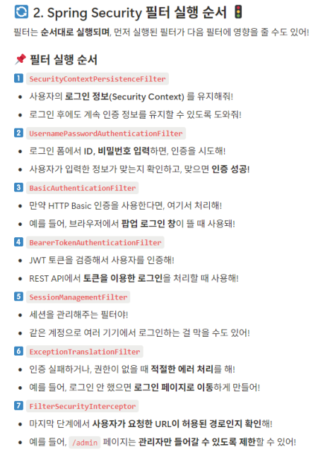
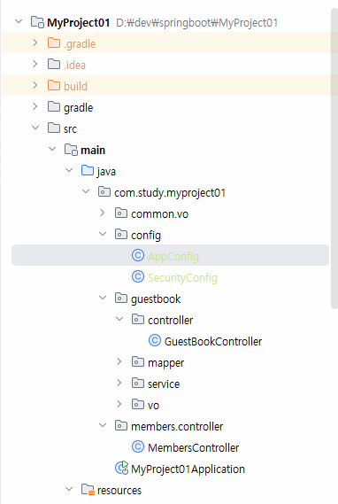
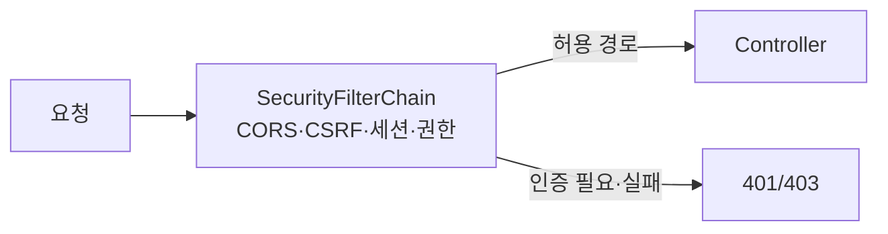

# Spring Boot 02 — Spring Security

> 실습 코드: [`code/springboot/01-jwt-MyProject01`](../../code/springboot/01-jwt-MyProject01)
> 참조: <https://docs.spring.io/spring-security/reference/servlet/configuration/java.html>

---

## 1. 인증(Authentication) vs 인가(Authorization)

Spring Security는 애플리케이션 **보안을 강화**하는 프레임워크입니다. 두 축으로 나뉩니다.

### Authentication (인증) — "당신이 누구인가" 신원 확인
| 구성요소 | 역할 |
|---|---|
| `AuthenticationManager` | 인증 처리 핵심 인터페이스 |
| `UserDetailsService` | 사용자 정보를 로드 |
| `PasswordEncoder` | 비밀번호 암호화/검증 |
| `SecurityContextHolder` | 인증된 사용자 정보를 전역 저장·관리 |

### Authorization (인가) — "그것을 할 권한이 있는가" 접근 확인
| 구성요소 | 역할 |
|---|---|
| `SecurityFilterChain` | HTTP 요청 보안 규칙을 정의하는 필터 체인 |
| `GrantedAuthority` | 사용자의 권한 정보 |
| `AccessDecisionManager` | 접근 권한 결정 |

## 2. Spring Security 필터 실행 순서

필터는 **순서대로** 실행되며, 먼저 실행된 필터가 다음 필터에 영향을 줍니다.



1. **SecurityContextPersistenceFilter** — 로그인 정보(인증) 유지
2. **UsernamePasswordAuthenticationFilter** — ID/비밀번호 확인
3. **BasicAuthenticationFilter** — HTTP Basic(팝업 로그인) 처리
4. **BearerTokenAuthenticationFilter** — JWT 토큰 검증
5. **SessionManagementFilter** — 세션 관리(중복 로그인 차단 등)
6. **ExceptionTranslationFilter** — 인증/인가 예외 처리
7. **FilterSecurityInterceptor** — 요청 URL이 허용된 경로인지 확인

> 본 프로젝트는 JWT를 쓰므로, 직접 만든 `JwtRequestFilter`를 `UsernamePasswordAuthenticationFilter` **앞에** 삽입합니다. → [JWT 편](03-jwt.md)

## 3. 프로젝트 구조



`config/` 아래에 `AppConfig`(PasswordEncoder)와 `SecurityConfig`(필터체인)를 둡니다.

## 4. 의존성 추가

```gradle
// build.gradle
implementation 'org.springframework.boot:spring-boot-starter-security'
```

## 5. `SecurityConfig` — 보안 규칙 정의

```java
@Slf4j @Configuration @EnableWebSecurity   // 부팅 시 실행 + 웹 보안 활성화
public class SecurityConfig {
    @Bean
    SecurityFilterChain securityFilterChain(HttpSecurity http,
                                            CorsConfigurationSource corsConfigurationSource) throws Exception {
        http
          // ① CORS — 출처가 다른 서버 간 리소스 공유 허용 (React:3000 ↔ Spring:8080)
          .cors(cors -> cors.configurationSource(corsConfigurationSource()))
          // ② CSRF 비활성 — JWT 사용 시 CSRF 위험이 없으므로 끔
          .csrf(csrf -> csrf.disable())
          // ③ 세션 STATELESS — 세션을 만들지 않음(JWT 권장)
          .sessionManagement(s -> s.sessionCreationPolicy(SessionCreationPolicy.STATELESS))
          // ④ 요청별 권한
          .authorizeHttpRequests(auth -> auth
              .requestMatchers("/members/**").permitAll()
              .requestMatchers("/guestbook/**").permitAll()
              .anyRequest().authenticated());
        return http.build();
    }

    @Bean
    CorsConfigurationSource corsConfigurationSource() {
        CorsConfiguration c = new CorsConfiguration();
        c.setAllowedOrigins(Arrays.asList("http://localhost:3000"));   // 리액트
        c.setAllowedMethods(Arrays.asList("GET","POST","PUT","DELETE","OPTIONS"));
        c.setAllowedHeaders(Arrays.asList("*"));
        c.setAllowCredentials(true);
        UrlBasedCorsConfigurationSource src = new UrlBasedCorsConfigurationSource();
        src.registerCorsConfiguration("/**", c);
        return src;
    }
}
```

> 💡 **CORS**: 서로 다른 출처(origin) 간 요청을 차단하는 브라우저 정책. React(3000)와 Spring(8080)은 포트가 다르므로 출처가 다릅니다 → 서버에서 명시적으로 허용해야 합니다.
> 💡 **CSRF**: 로그인된 상태를 악용해 악성 사이트가 사용자 권한으로 요청을 보내는 공격. JWT(헤더 기반)는 쿠키 자동전송에 의존하지 않으므로 비활성화합니다.

## 6. `AppConfig` — 비밀번호 암호화

```java
@Configuration
public class AppConfig {
    @Bean
    public PasswordEncoder passwordEncoder() {
        return new BCryptPasswordEncoder();   // 단방향 BCrypt 해시
    }
}
```

회원가입 시 `passwordEncoder.encode(pw)`로 저장하고, 로그인 시 `passwordEncoder.matches(입력, 저장된해시)`로 검증합니다.



---

### 다음 단계
- [Spring Boot 03 — JWT](03-jwt.md)
- [React ↔ Spring Boot JWT 연동 흐름](../integration/react-springboot-jwt-flow.md)
