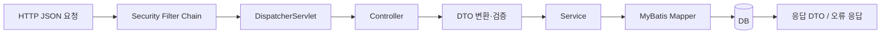

# Spring Boot 04 — REST API를 한 단계 더 탄탄하게 만들기

> 기존 `MyProject01`, `MyProject02`는 Controller → Service → Mapper → DB와 JWT 흐름을 눈으로 확인하기 위한 학습 코드입니다.
>
> 이 장은 그 다음 단계입니다. 간단한 홈페이지를 실제로 운영 가능한 구조에 가깝게 다듬으려면 무엇을 추가해야 하는지 설명합니다.

## 1. 현재 기준: Spring Boot 4.0.6

이 저장소의 두 Spring Boot 프로젝트는 `4.0.6`을 사용합니다.

```gradle
plugins {
    id 'org.springframework.boot' version '4.0.6'
}
```

Spring Boot 공식 [System Requirements](https://docs.spring.io/spring-boot/system-requirements.html)에 따르면 `4.0.6`은 Java 17 이상을 요구하고 Java 26까지 호환됩니다. 이 교재는 학습 환경을 통일하기 위해 **Java 21**을 사용합니다.

| 항목 | Spring Boot 4.0.6 공식 기준 | 이 교재 |
|---|---|---|
| Java | 17 이상, 26 이하 호환 | Java 21 |
| Gradle | 8.14 이상 8.x 또는 9.x | Wrapper로 고정 |
| 내장 Servlet 컨테이너 | Tomcat 11.0.x 등 | starter 기본 내장 서버 |
| 실행 방식 | `java -jar` 또는 전통적 배포 | 개발 중 `./gradlew bootRun` |

## 2. 요청 한 번이 지나가는 길

React가 `POST /guestbook/insert`를 호출하면 서버 내부에서는 여러 단계가 이어집니다.



| 단계 | 책임 | 실패 예 |
|---|---|---|
| Security Filter | 인증 토큰 확인, 접근 권한 결정 | 401, 403 |
| Controller | URL과 HTTP 메서드를 Java 메서드에 연결 | JSON 형식 오류 |
| DTO + Validation | 입력 형식 검증 | 빈 제목, 잘못된 이메일 |
| Service | 업무 규칙 처리 | 비밀번호 불일치 |
| Mapper | SQL 실행 | 중복 아이디, DB 연결 실패 |
| Exception Handler | 실패를 일관된 응답으로 변환 | 400, 404, 409, 500 |

초심자가 흔히 하는 실수는 모든 책임을 Controller의 `try-catch` 안에 넣는 것입니다. 기능은 작동하지만, API가 늘어날수록 중복 코드가 커지고 오류 응답이 제각각이 됩니다.

## 3. VO와 요청 DTO를 분리합니다

현재 실습은 흐름을 짧게 보여주기 위해 `MembersVO`를 DB 조회 결과와 요청 바디에 함께 사용합니다.

```java
@PostMapping("/register")
public DataVO register(@RequestBody MembersVO member) { ... }
```

다음 단계에서는 API 입력 전용 DTO를 만듭니다.

```java
public record RegisterRequest(
    String id,
    String password,
    String name,
    String email
) {}
```

| 구분 | 역할 | 예 |
|---|---|---|
| Request DTO | 브라우저가 보낼 수 있는 입력만 정의 | `RegisterRequest` |
| Response DTO | 브라우저에 공개해도 되는 출력만 정의 | `MemberProfileResponse` |
| VO 또는 Entity | DB 레코드와 가까운 내부 모델 | `MembersVO` |

분리하면 다음 위험을 줄일 수 있습니다.

- 요청자가 `m_active`, `m_active_reg` 같은 내부 상태를 임의로 보냄
- 비밀번호 해시가 응답 JSON에 섞여 나감
- DB 컬럼 변경이 곧바로 프론트 API 계약 변경으로 이어짐

## 4. Bean Validation으로 입력을 입구에서 거릅니다

Spring MVC 공식 [`@RequestBody`](https://docs.spring.io/spring-framework/reference/web/webmvc/mvc-controller/ann-methods/requestbody.html) 문서는 `@Valid` 또는 `@Validated`를 함께 사용하면 표준 Bean Validation을 적용할 수 있다고 설명합니다.

먼저 의존성을 추가합니다.

```gradle
implementation 'org.springframework.boot:spring-boot-starter-validation'
```

요청 DTO에 규칙을 선언합니다.

```java
import jakarta.validation.constraints.Email;
import jakarta.validation.constraints.NotBlank;
import jakarta.validation.constraints.Size;

public record RegisterRequest(
    @NotBlank
    @Size(min = 4, max = 30)
    String id,

    @NotBlank
    @Size(min = 8, max = 100)
    String password,

    @NotBlank
    @Size(max = 50)
    String name,

    @NotBlank
    @Email
    String email
) {}
```

Controller에서는 `@Valid`를 붙입니다.

```java
@PostMapping("/members")
public ResponseEntity<MemberProfileResponse> register(
    @Valid @RequestBody RegisterRequest request
) {
    return ResponseEntity
        .status(HttpStatus.CREATED)
        .body(memberService.register(request));
}
```

검증 실패는 기본적으로 400 Bad Request로 처리됩니다. 필드별 오류 메시지를 프론트 폼 아래에 표시하려면 전역 오류 처리에서 필요한 형태로 변환합니다.

!!! note "학습 코드와 완성 코드의 차이"
    현재 저장소의 회원가입 비밀번호 `1111`은 로컬 실습 계정입니다. 운영 정책 예시에서는 8자 이상처럼 더 강한 규칙을 적용하세요.

## 5. HTTP 메서드와 상태 코드는 API의 언어입니다

현재 `DataVO`의 `{success, message, data}` 형식은 초심자가 응답을 읽기 쉽도록 만든 공통 래퍼입니다. 다음 단계에서는 HTTP 상태 코드도 함께 정확하게 사용합니다.

| 작업 | 메서드 | 성공 상태 | 대표 실패 상태 |
|---|---|---|---|
| 목록 조회 | `GET /guestbook` | `200 OK` | `500 Internal Server Error` |
| 상세 조회 | `GET /guestbook/{id}` | `200 OK` | `404 Not Found` |
| 등록 | `POST /guestbook` | `201 Created` | `400 Bad Request` |
| 수정 | `PUT /guestbook/{id}` 또는 `PATCH` | `200 OK` | `400`, `404`, `403` |
| 삭제 | `DELETE /guestbook/{id}` | `204 No Content` | `404`, `403` |
| 로그인 실패 | `POST /members/login` | 상황에 따라 `401 Unauthorized` | `401` |
| 권한 부족 | 보호 API | - | `403 Forbidden` |
| 중복 아이디 | `POST /members` | - | `409 Conflict` |

`401`과 `403`을 구분하세요.

- `401 Unauthorized`: 인증 정보가 없거나 유효하지 않음
- `403 Forbidden`: 누구인지 알지만 해당 작업 권한이 없음

## 6. 오류 응답을 한 곳에서 관리합니다

Spring Framework는 REST 오류 응답을 위해 RFC 9457 기반 [`ProblemDetail`](https://docs.spring.io/spring-framework/reference/web/webmvc/mvc-ann-rest-exceptions.html)을 지원합니다.

```java
@RestControllerAdvice
public class ApiExceptionHandler {

    @ExceptionHandler(IllegalArgumentException.class)
    ProblemDetail handleIllegalArgument(IllegalArgumentException e) {
        ProblemDetail problem = ProblemDetail.forStatus(HttpStatus.BAD_REQUEST);
        problem.setTitle("잘못된 요청");
        problem.setDetail(e.getMessage());
        return problem;
    }
}
```

예상 응답:

```json
{
  "type": "about:blank",
  "title": "잘못된 요청",
  "status": 400,
  "detail": "비밀번호가 일치하지 않습니다.",
  "instance": "/guestbook/15"
}
```

두 접근을 비교하면 다음과 같습니다.

| 접근 | 장점 | 적합한 단계 |
|---|---|---|
| 현재 `DataVO` | 구조가 단순하고 강의 흐름을 따라가기 쉬움 | 첫 REST API 실습 |
| `ResponseEntity<DataVO>` | 기존 구조를 유지하면서 HTTP 상태 코드 학습 | 다음 리팩터링 |
| `ProblemDetail` + DTO | 표준 오류 응답과 역할 분리가 선명 | 운영형 API 확장 |

## 7. 환경마다 설정을 분리합니다

Spring Boot 공식 [Externalized Configuration](https://docs.spring.io/spring-boot/reference/features/external-config.html)은 같은 코드를 환경별 설정으로 실행할 수 있도록 YAML, 환경변수, 명령행 인자 등을 지원합니다.

이 저장소도 이미 같은 원칙을 사용합니다.

```yaml
spring:
  datasource:
    url: ${DB_URL:jdbc:oracle:thin:@localhost:1521:xe}
    username: ${DB_USERNAME:c##dbuser}
    password: ${DB_PASSWORD:1111}
```

| 환경 | 설정 | 목적 |
|---|---|---|
| 로컬 Oracle XE | `application.yaml` 기본값 | 최종 연동 실습 |
| Actions H2 | `application-snapshot.yaml` | 자동 API 스냅샷 |
| 외부 배포 | 환경변수 또는 Secret Manager | 실제 비밀번호와 서명 키 보호 |

프로필은 다음처럼 켭니다.

```bash
./gradlew bootRun --args='--spring.profiles.active=snapshot'
```

## 8. 비밀번호와 토큰은 서로 다른 문제를 풉니다

Spring Security 공식 [Password Storage](https://docs.spring.io/spring-security/reference/features/authentication/password-storage.html)는 비밀번호를 복호화 가능한 형태가 아니라 **단방향 적응형 함수**로 저장할 것을 권장합니다.

```java
PasswordEncoder encoder = new BCryptPasswordEncoder();
String hash = encoder.encode(rawPassword);
boolean matched = encoder.matches(rawPassword, hash);
```

| 값 | 저장 위치 | 이유 |
|---|---|---|
| 사용자 비밀번호 원문 | 저장하지 않음 | 유출 피해 방지 |
| BCrypt 해시 | DB | 로그인 시 `matches`로 검증 |
| Access Token | 클라이언트, 짧은 수명 | 매 요청 인증 |
| Refresh Token | 서버 DB에도 보관 | 재발급 통제, 로그아웃·회수 |
| JWT 서명 키 | 서버 환경변수 또는 Secret Manager | 토큰 위조 방지 |

## 9. 테스트를 층으로 나눕니다

한 종류의 테스트만으로는 충분하지 않습니다.

| 테스트 층 | 무엇을 확인하나요? | 이 저장소의 예 |
|---|---|---|
| 컴파일·컨텍스트 | 빈 등록, 의존성, 기본 부팅 | `./gradlew clean build` |
| Web 계층 | URL, JSON, 검증, 상태 코드 | 다음 확장: MockMvc |
| DB 통합 | 실제 SQL과 스키마 | MySQL smoke, H2 snapshot |
| 브라우저 흐름 | 로그인 후 화면과 CRUD | Pages mock 데모 수동 점검 |

MockMvc를 추가할 때는 다음 질문을 테스트로 고정합니다.

```text
1. 로그인 없이 보호 API를 호출하면 401인가?
2. 빈 제목으로 방명록을 등록하면 400인가?
3. 다른 작성자가 수정하면 403인가?
4. 없는 글을 조회하면 404인가?
5. 응답에 비밀번호 해시가 포함되지 않는가?
```

## 10. 선택 확장: Actuator health

서버가 떠 있는지 자동으로 확인하려면 Spring Boot Actuator의 health endpoint를 검토할 수 있습니다.

```gradle
implementation 'org.springframework.boot:spring-boot-starter-actuator'
```

```yaml
management:
  endpoints:
    web:
      exposure:
        include: health
```

운영 환경에서 모든 관리 endpoint를 무작정 공개하지 않습니다. 처음에는 `health`만 노출하고, 인증과 네트워크 접근 정책을 별도로 설계하세요. 공식 문서는 [Actuator](https://docs.spring.io/spring-boot/how-to/actuator.html)에서 확인할 수 있습니다.

### 다음 단계

- [최종 프로젝트 — 간단한 홈페이지 완성 로드맵](../integration/final-homepage-roadmap.md)
- [React ↔ Spring Boot JWT 흐름](../integration/react-springboot-jwt-flow.md)
